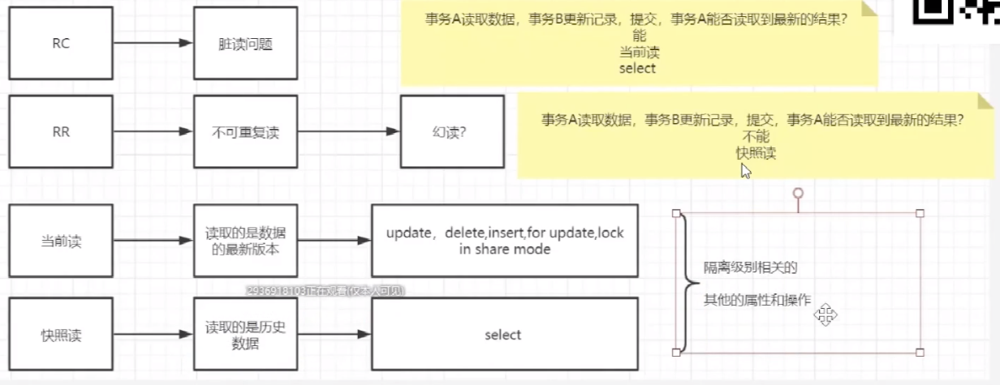
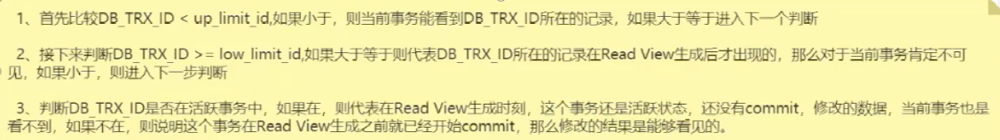
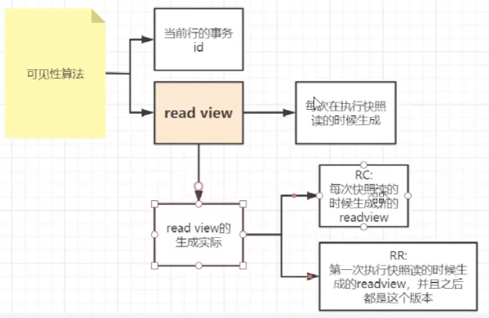
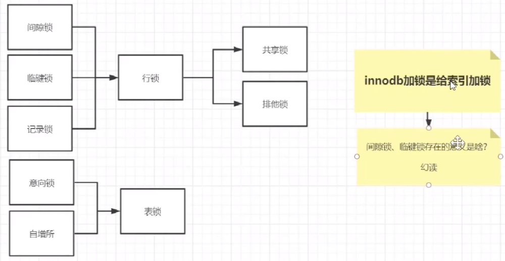
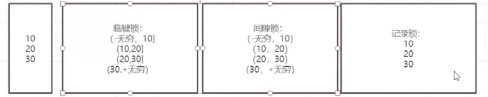

[TOC]

## MVCC机制和锁

### 1. 当前读和快照读

MySQL的InnoDB存储引擎默认事务隔离级别是RR(可重复读), 是通过 “行排他锁+MVCC” 一起实现的, 不仅可以保证可重复读, 还可以部分防止幻读, 而非完全防止。为什么是部分防止幻读, 而不是完全防止?

<li>效果: 在如果事务B在事务A执行中, insert了一条数据并提交, 事务A再次查询, 虽然读取的是undo中的旧版本数据(防止了部分幻读), 但是事务A中执行update或者delete都是可以成功的!!（可以再结合后面的解释加以理解）</li>
<li>因为在innodb中的操作可以分为当前读(current read)和快照读(snapshot read)</li>

innodb在RR级别中
<li>当前读通过record lock和gap lock实现的</li>
<li>快照读通过MVCC和undolog实现的</li>

innodb在快照读的情况下并没有真正的避免幻读, 但是在当前读的情况下避免了不可重复读和幻读

### 2. MVCC机制
MVCC是多版本并发控制

MVCC可以主要参考文章对比着看：<a href="https://segmentfault.com/a/1190000012650596">https://segmentfault.com/a/1190000012650596</a>

####  2.1 行数据的后面三个字段
<li>InnoDB存储引擎在数据库每行数据的后面添加了三个字段</li>
<li>innodb存储引擎每次再进行数据插入的时候，数据必须要跟某一个索引列绑定在一起，这个索引列有一个选择的顺序： 主键 > 唯一键 > 自动生成6字节的rowid</li>

####  2.2 undolog保证了原子性
事务中数据的历史版本保存在undolog，可以通过回滚指针实现事务回滚

事务提交后可以清除无效的历史数据

####  2.3 Read view
当前存在多个历史版本数据的时候，会涉及到一个可见性算法，来计算当前事务读取的是哪一个版本的历史数据

read view:

当进行快照读的时候会生成一个事务id的列表，来保存不同的信息，通过这些星系来做可见性判断

上面的id都是行数据后面三字段中的事务id

MVCC中隔离级别RC和RR的区别：在于readview的生成时机

### 3.锁

MySQL锁的分类

#### 3.1 三种行锁的区别

#### 3.2 幻读
部分解决幻读的理解

如果全是快照读不会出现幻读（MVCC保证的）

如果全是当前读也是不会出现幻读的（记录锁和间隙锁保证的）

一个实例分析（出现幻读）：

<li>当前事务1先快照读（select）</li>
<li>随后事务2在当前事务1执行过程中插入或者删除行数据并成功提交</li>
<li>当前事务1又执行了当前读(如update)，发现突然突然增加或者减少了一行</li>