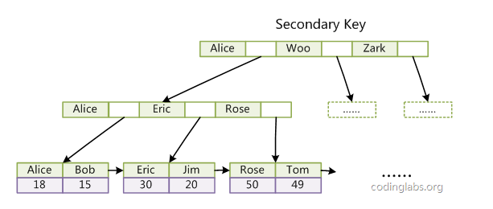
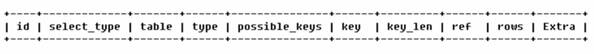
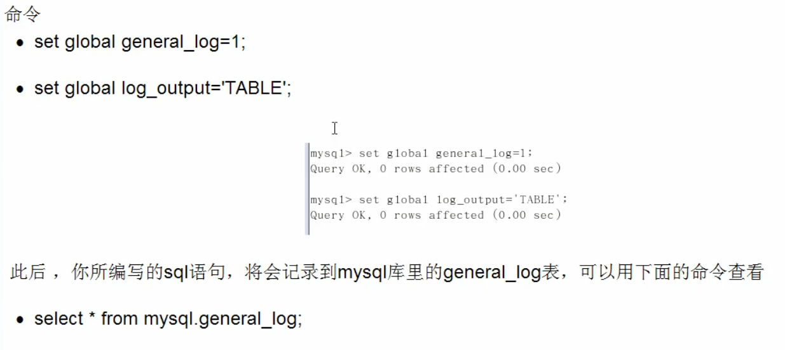
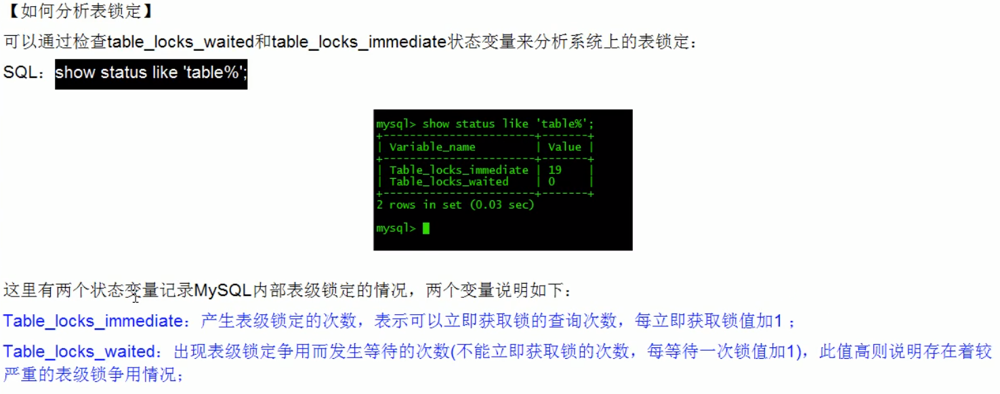
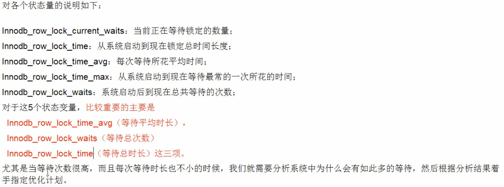

[TOC]
### MYSQL高级
<hr/>
内容说明：

MySQL 是目前最流行的关系型数据库管理系统，在 WEB 应用方面 MySQL 也是目前最好的 RDBMS 应用软件之一。随着淘宝去IOE(去除IBM小型机、Oracle数据库及EMC存储设备)化的推进，MySQL 数据库在当前的互联网应用中变得越来越重要。

包括的MySQL 高级知识：索引，如何避免索引失效，索引优化策略，innodb和myisam存储引擎，MySQL锁机制，配置MySQL主从复制，explain、show profile、慢查询日志等日常SQL诊断和性能分析策略。

### 1.MySQL的架构介绍
<hr/>

#### 1.1 MySQL简介
<li>概述：关系型数据库管理系统RDBMS</li>
<li>高级MySQL：完整的mysql优化需要很深的功底，大公司有专门的DBA</li>
<ol>️数据库内部结构和原理</ol>
<ol>数据库索引建立</ol>
<ol>SQL语句优化</ol>
<ol>SQL编程</ol>
<ol>mysql服务器安装配置</ol>
<ol>数据库的性能监控分析与系统优化</ol>
<ol>各种参数常量设定</ol>
<ol>主从复制</ol>
<ol>分布式架构搭建、垂直切割和水平切割</ol>
<ol>数据迁移</ol>
<ol>容灾备份和恢复</ol>
<ol>shell或python等脚本语言开发</ol>
<ol>对开源数据库进行二次开发</ol>

#### 1.2 MysqlLinux版的安装（mysql5.5）
<li>下载地址：</li>
官方地址: <a href="http://dev.mysql.com/downloads/mysql/">http://dev.mysql.com/downloads/mysql/</a>
<li>拷贝&解压缩</li>
<li>检查工作</li>
<ol>检查是否安装过mysql5</ol>

```
# 执行安装命令前，先执行查询命令
rpm -qa|grep mysql
# 如果存在mysql-libs的旧版本包如下：请先执行卸载命令
rpm -e --nodeps  mysql-libs  
```
<ol>由于mysql安装过程中，会通过mysql用户在/tmp目录下新建tmp_db文件，所以请给/tmp较大的权限执行</ol>

```
chmod -R 777 /tmp
```
<li>安装</li>

```
# 在mysql的安装文件目录下执行：
rpm -ivh MySQL-server-5.5.54-1.linux2.6.x86_64.rpmrpm -ivh MySQL-client-5.5.54-1.linux2.6.x86_64.rpm 
```

<li>查看MySQL安装版本</li>

```
mysqladmin --version
```

<li>mysql服务的启+停</li>

```
service mysql start
ps -ef|grep mysql # 查看服务是否开启
service mysql stop
```
<li>首次登陆</li>

安装完成后会提示出如下的提示：在mysql首次登录前要给 root 账号设置密码
```
# 启动服务后，执行命令 
/usr/bin/mysqladmin -u root  password '123123'
# 登录 
mysql -uroot -p123123  
```

<li>mysql服务的启+停</li>

```
service mysql start
ps -ef|grep mysql # 查看服务是否开启
service mysql stop
```


<li>自启动服务</li>

```
chkconfig mysql on # 设置开机自启动
chkconfig --list | grep mysql
ntsysv # 看到[*]mysql这一行，表示开机后会自启动mysql
```


<li>mysql服务的启+停</li>

```
ps -ef|grep mysql # 在linux下查看安装目录
```

参数路径解释备注
<ol>basedir: /usr/bin 相关命令目录mysqladmin mysqldump等命令</ol>
<ol>datadir: /var/lib/mysql/ mysql数据库文件的存放路径</ol>
<ol>plugin-dir: /usr/lib64/mysql/pluginmysql插件存放路径</ol>
<ol>log-error: /var/lib/mysql/jack.atguigu.errmysql错误日志路径</ol>
<ol>pid-file: /var/lib/mysql/jack.atguigu.pid进程pid文件</ol>
<ol>socket:/var/lib/mysql/mysql.sock本地连接时用的unix套接字文件</ol>
<ol>/usr/share/mysql 配置文件目录mysql脚本及配置文件</ol>
<ol>/etc/init.d/mysql服务启停相关脚本</ol>

<li>mysql修改字符集</li>

```
# 1. 查看字符集设置
show variables like 'character%';
show variables like '%char%';
# 默认的是客户端和服务器都用了latin1，所以会乱码

# 2. 修改my.cnf
# 在/usr/share/mysql/ 中找到my.cnf的配置文件，拷贝其中的my-huge.cnf 到/etc/, 并命名为my.cnf mysql
# 优先选中/etc/下的配置文件然后修改my.cnf:
[client]
default-character-set=utf8
[mysqld]
character_set_server=utf8character_set_client=utf8collation-server=utf8_general_ci
[mysql]
default-character-set=utf8

# 3. 重新启动mysql
# 但是原库的设定不会发生变化，参数修改之对新建的数据库生效 

# 4. 已生成的库表字符集如何变更修改数据库的字符集
alter database mytest character set 'utf8';
# 修改数据表的字符集
alter table user convert to  character set 'utf8'; 
但是原有的数据如果是用非'utf8'编码的话，数据本身不会发生改变。     
```
#### 1.3 mysql配置文件


#### 1.4 mysql逻辑框架简介


和其它数据库相比，MySQL有点与众不同，**它的架构可以在多种不同场景中应用并发挥良好作用。**

主要体现在存储引擎的架构上，**插件式的存储引擎架构**将查询处理和其它的系统任务以及数据的存储提取相分离。

这种架构可以根据业务的需求和实际需要选择合适的存储引擎

<li>连接层</li>
最上层是一些客户端和连接服务，包含本地sock通信和大多数基于客户端/服务端工具实现的类似于tcp/ip的通信。主要完成一些类似于连接处理、授权认证、及相关的安全方案。
在该层上引入了线程池的概念，为通过认证安全接入的客户端提供线程。同样在该层上可以实现基于SSL的安全链接。服务器也会为安全接入的每个客户端验证它所具有的操作权限。

<li>服务层</li>
i.Management Serveices & Utilities： 系统管理和控制工具<br>
ii.SQL Interface: SQL接口 接受用户的SQL命令，并且返回用户需要查询的结果。比如select from就是调用SQL Interface<br>
iii.Parser: 解析器 SQL命令传递到解析器的时候会被解析器验证和解析。<br>
iv.Optimizer: 查询优化器。 SQL语句在查询之前会使用查询优化器对查询进行优化。 用一个例子就可以理解： select uid,name from user where gender= 1; 优化器来决定先投影还是先过滤。<br>
v.Cache和Buffer： 查询缓存。 如果查询缓存有命中的查询结果，查询语句就可以直接去查询缓存中取数据。 这个缓存机制是由一系列小缓存组成的。比如表缓存，记录缓存，key缓存，权限缓存等 缓存是负责读，缓冲负责写。<br>

<li>引擎层</li>

存储引擎层，存储引擎真正的负责了MySQL中数据的存储和提取，服务器通过API与存储引擎进行通信。不同的存储引擎具有的功能不同，这样我们可以根据自己的实际需要进行选取。后面介绍MyISAM和InnoDB

<li>存储层</li>

数据存储层，主要是将数据存储在运行于裸设备的文件系统之上，并完成与存储引擎的交互。

#### 1.5 mysql存储引擎
##### 1.5.1 查看命令
```
# 看你的mysql现在已提供什么存储引擎
show engines; 
# 看你的mysql当前默认的存储引擎:  
show variables like '%storage_engine%'; 
```
##### 1.5.2 MyISAM和InnoDB


##### 1.5.3 各个存储引擎介绍

1.**InnoDB**存储引擎：InnoDB是MySQL的默认事务型引擎，它被设计用来处理大量的短期(short-lived)事务。除非有非常特别的原因需要使用其他的存储引擎，否则应该优先考虑InnoDB引擎。行级锁，适合高并发情况

2.**MyISAM**存储引擎：MyISAM提供了大量的特性，包括全文索引、压缩、空间函数(GIS)等，但MyISAM不支持事务和行级锁(myisam改表时会将整个表全锁住)，有一个毫无疑问的缺陷就是崩溃后无法安全恢复。

3.Archive引擎：Archive存储引擎只支持INSERT和SELECT操作，在MySQL5.1之前不支持索引。Archive表适合日志和数据采集类应用。适合低访问量大数据等情况。根据英文的测试结论来看，Archive表比MyISAM表要小大约75%，比支持事务处理的InnoDB表小大约83%。

4.Blackhole引擎：Blackhole引擎没有实现任何存储机制，它会丢弃所有插入的数据，不做任何保存。但服务器会记录Blackhole表的日志，所以可以用于复制数据到备库，或者简单地记录到日志。但这种应用方式会碰到很多问题，因此并不推荐。

5.CSV引擎：CSV引擎可以将普通的CSV文件作为MySQL的表来处理，但不支持索引。CSV引擎可以作为一种数据交换的机制，非常有用。CSV存储的数据直接可以在操作系统里，用文本编辑器，或者excel读取。

6.Memory引擎：如果需要快速地访问数据，并且这些数据不会被修改，重启以后丢失也没有关系，那么使用Memory表是非常有用。Memory表至少比MyISAM表要快一个数量级。(使用专业的内存数据库更快，如redis)

7.Federated引擎：Federated引擎是访问其他MySQL服务器的一个代理，尽管该引擎看起来提供了一种很好的跨服务器的灵活性，但也经常带来问题，因此默认是禁用的。

##### 1.5.4 阿里巴巴、淘宝用哪个


### 2.索引优化分析
#### 2.1 性能下降SQL慢 执行时间长 等待时间长


#### 2.2 常见通用的join查询


<li>SQL解析：机读顺序（先from）</li>


<li>Join图（重点，基本功一定要记住）：</li>


#### 2.3 索引简介
##### 2.3.1 索引是什么（重点）
###### MySQL官方对索引的定义为：索引（Index）是帮助MySQL高效获取数据的数据结构。
<li>索引的本质：索引是数据结构</li><br/>
<li>索引的目的：在于提高查询效率</li><br/>
可以类比字典，如果要查“mysql”这个单词，我们肯定需要定位到m字母，然后从下往下找到y字母，再找到剩下的sql。如果没有索引，那么你可能需要a—-z，如果我想找到Java开头的单词呢？或者Oracle开头的单词呢？是不是觉得如果没有索引，这个事情根本无法完成？
<li>简单理解： 索引是排好序的快速查找数据结构</li>
简单理解： 索引是排好序的快速查找数据结构

简单理解： 索引是排好序的快速查找数据结构


<ol>二叉树弊端之一：二叉树很可能会发生两边不平衡的情况。</ol>
<ol>B-TREE：(B:balance) 会自动根据两边的情况自动调节，使两端无限趋近于平衡状态。可以使性能最稳定。(myisam使用的方式)</ol>
<ol>B-TREE弊端：(插入/修改操作多时，B-TREE会不断调整平衡，消耗性能)从侧面说明了索引不是越多越好。</ol>
<ol>B+TREE：Innodb 所使用的索引</ol>

<li>我们平常所说的索引，如果没有特别指明，都是指B树(多路搜索树，并不一定是二叉的)结构组织的索引。其中聚集索引，次要索引，覆盖索引，复合索引，前缀索引，唯一索引默认都是使用B+树索引，统称索引。当然，除了B+树这种类型的索引之外，还有哈稀索引(hash index)等。</li>

##### 2.3.2 索引的优势
<li>类似大学图书馆建书目索引，提高数据检索的效率，降低数据库的IO成本/li>
<li>通过索引列对数据进行排序，降低数据排序的成本，降低了CPU的消耗</li>

##### 2.3.3 索引的劣势
<li>实际上索引也是一张表，该表保存了主键与索引字段，并指向实体表的记录，所以索引列也是要占用空间的</li><br/>
<li>虽然索引大大提高了查询速度，同时却会降低更新表的速度，如对表进行INSERT、UPDATE和DELETE。因为更新表时，MySQL不仅要保存数据，还要保存一下索引文件每次更新添加了索引列的字段，都会调整因为更新所带来的键值变化后的索引信息</li><br/>
<li>索引只是提高效率的一个因素，如果你的MySQL有大数据量的表，就需要花时间研究建立最优秀的索引，或优化查询语句</li>


##### 2.3.4 索引的分类

###### 2.3.4.1 单值索引
###### 即一个索引只包含单个列，一个表可以有多个单列索引

###### 2.3.4.2 唯一索引
###### 索引列的值必须唯一，但允许有空值

###### 2.3.4.3 复合索引
###### 即一个索引包含多个列

###### 2.3.4.4 主键索引

###### 设定为主键后数据库会自动建立索引，innodb为聚簇（聚集）索引

###### 因为InnoDB的数据文件本身要按主键聚集，所以InnoDB要求表必须有主键（MyISAM可以没有），如果没有显式指定，则MySQL系统会自动选择一个可以唯一标识数据记录的列作为主键，如果不存在这种列，则MySQL自动为InnoDB表生成一个隐含字段作为主键，这个字段长度为6个字节，类型为长整形。


###### 2.3.4.5 基本语法
```
# 1. 创建
CREATE [UNIQUE] INDEX indexName ON mytable(columnname(length))
ALTER mytable ADD  [UNIQUE ]  INDEX [indexName] ON (columnname(length)) 

# 2. 删除
DROP INDEX [indexName] ON mytable

# 3. 查看
SHOW INDEX FROM table_name\G

# 4. 使用ALTER命令
# 有四种方式来添加数据表的索引：
ALTER TABLE tbl_name ADD PRIMARY KEY (column_list) # 该语句添加一个主键，这意味着索引值必须是唯一的，且不能为NULL。
ALTER TABLE tbl_name ADD UNIQUE index_name (column_list) # 这条语句创建索引的值必须是唯一的（除了NULL外，NULL可能会出现多次
ALTER TABLE tbl_name ADD INDEX index_name (column_list) # 添加普通索引，索引值可出现多次。
ALTER TABLE tbl_name ADD FULLTEXT index_name (column_list) #该语句指定了索引为 FULLTEXT ，用于全文索引。 
```

######  2.3.5 mysql索引结构⭐


<li>为了描述B-Tree，首先定义一条数据记录为一个二元组[key, data]，key为记录的键值，对于不同数据记录，key是互不相同的；data为数据记录除key外的数据。那么B-Tree是满足下列条件的数据结构：</li>
<ol>d为大于1的一个正整数，称为B-Tree的度。</ol>
<ol>h为一个正整数，称为B-Tree的高度。</ol>
<ol>每个非叶子节点由n-1个key和n个指针组成，其中d<=n<=2d。</ol>
<ol>每个叶子节点最少包含一个key和两个指针，最多包含2d-1个key和2d个指针，叶节点的指针均为null 。</ol>
<ol>所有叶节点具有相同的深度，等于树高h。</ol>
<ol>key和指针互相间隔，节点两端是指针。</ol>
<ol>一个节点中的key从左到右非递减排列。</ol>
<ol>所有节点组成树结构。</ol>
<ol>每个指针要么为null，要么指向另外一个节点。</ol>
<ol>如果某个指针在节点node最左边且不为null，则其指向节点的所有key小于v(key_1)，其中v(key_1)为node的第一个key的值。</ol>
<ol>如果某个指针在节点node最右边且不为null，则其指向节点的所有key大于v(key_m)，其中v(key_m)为node的最后一个key的值。</ol>
<ol>如果某个指针在节点node的左右相邻key分别是key_i和key{i+1}且不为null，则其指向节点的所有key小于v(key{i+1})且大于v(key_i)</ol>


由于B-Tree的特性，在B-Tree中按key检索数据的算法非常直观：首先从根节点进行二分查找，如果找到则返回对应节点的data，否则对相应区间的指针指向的节点递归进行查找，直到找到节点或找到null指针，前者查找成功，后者查找失败。B-Tree上查找算法的伪代码如下：
```
BTree_Search(node, key) {
    if(node == null) return null;
    foreach(node.key)
    {
        if(node.key[i] == key) return node.data[i];
            if(node.key[i] > key) return BTree_Search(point[i]->node);
    }
    return BTree_Search(point[i+1]->node);
}
data = BTree_Search(root, my_key);
```

关于B-Tree有一系列有趣的性质，例如一个度为d的B-Tree，设其索引N个key，则其树高h的上限为logd((N+1)/2)logd((N+1)/2)，检索一个key，其查找节点个数的渐进复杂度为O(logdN)O(logdN)。从这点可以看出，B-Tree是一个非常有效率的索引数据结构。

另外，由于插入删除新的数据记录会破坏B-Tree的性质，因此在插入删除时，需要对树进行一个分裂、合并、转移等操作以保持B-Tree性质，本文不打算完整讨论B-Tree这些内容，因为已经有许多资料详细说明了B-Tree的数学性质及插入删除算法，有兴趣的朋友可以在本文末的参考文献一栏找到相应的资料进行阅读。


<li>B+Tree[1]</li>
B-Tree有许多变种，其中最常见的是B+Tree，例如MySQL就普遍使用B+Tree实现其索引结构。

与B-Tree相比，B+Tree有以下不同点：

<ol>每个节点的指针上限为2d而不是2d+1。</ol>
<ol>内节点不存储data，只存储key；叶子节点不存储指针。</ol>


由于并不是所有节点都具有相同的域，因此B+Tree中叶节点和内节点一般大小不同。这点与B-Tree不同，虽然B-Tree中不同节点存放的key和指针可能数量不一致，但是每个节点的域和上限是一致的，所以在实现中B-Tree往往对每个节点申请同等大小的空间。

一般来说，B+Tree比B-Tree更适合实现外存储索引结构，具体原因与外存储器原理及计算机存取原理有关。


<li>带有顺序访问指针的B+Tree[1]</li>
一般在数据库系统或文件系统中使用的B+Tree结构都在经典B+Tree的基础上进行了优化，增加了顺序访问指针


在B+Tree的每个叶子节点增加一个指向相邻叶子节点的指针，就形成了带有顺序访问指针的B+Tree。做这个优化的目的是为了提高区间访问的性能，例如图4中如果要查询key为从18到49的所有数据记录，当找到18后，只需顺着节点和指针顺序遍历就可以一次性访问到所有数据节点，极大提高了区间查询效率。


<li>为什么使用B-Tree（B+Tree）[1]</li>
红黑树等数据结构也可以用来实现索引，但是文件系统及数据库系统普遍采用B-/+Tree作为索引结构，结合计算机组成原理相关知识讨论B-/+Tree作为索引的理论基础

考虑到**主存存取原理，磁盘存取原理，局部性原理与磁盘预读**详细见[1]

<ol>一般使用磁盘I/O次数评价索引结构的优劣。</ol>
<ol>先从B-Tree分析，根据B-Tree的定义，可知检索一次最多需要访问h个节点。数据库系统的设计者巧妙利用了磁盘预读原理，将一个节点的大小设为等于一个页，这样每个节点只需要一次I/O就可以完全载入。为了达到这个目的，在实际实现B-Tree还需要使用如下技巧：</ol>
每次新建节点时，直接申请一个页的空间，这样就保证一个节点物理上也存储在一个页里，加之计算机存储分配都是按页对齐的，就实现了一个node只需一次I/O。

<ol>B-Tree中一次检索最多需要h-1次I/O（根节点常驻内存），渐进复杂度为$O(h)=O(logdN)$。一般实际应用中，出度d是非常大的数字，通常超过100，因此h非常小（通常不超过3）</ol>
<ol>综上所述，用B-Tree作为索引结构效率是非常高的</ol>
<ol>红黑树这种结构，h明显要深的多。由于逻辑上很近的节点（父子）物理上可能很远，无法利用局部性，所以红黑树的I/O渐进复杂度也为O(h)，效率明显比B-Tree差很多</ol>

<li>B+Tree适合外存索引的原因[1]：</li>


<li>B+Tree的索引id为什么设置为自增有益于索引维护</li>
<ol>可以避免页分裂和页合并</ol>
<li>MyISAM索引实现[1]</li>
<ol>MyISAM引擎使用B+Tree作为索引结构，叶节点的data域存放的是数据记录的地址。下图是MyISAM索引的原理图：</ol>


这里设表一共有三列，假设我们以Col1为主键，则图8是一个MyISAM表的主索引（Primary key）示意。可以看出MyISAM的索引文件仅仅保存数据记录的地址。在MyISAM中，主索引和辅助索引（Secondary key）在结构上没有任何区别，只是主索引要求key是唯一的，而辅助索引的key可以重复。如果我们在Col2上建立一个辅助索引，则此索引的结构如下图所示：


同样也是一颗B+Tree，data域保存数据记录的地址。因此，MyISAM中索引检索的算法为首先按照B+Tree搜索算法搜索索引，如果指定的Key存在，则取出其data域的值，然后以data域的值为地址，读取相应数据记录。

MyISAM的索引方式也叫做“非聚集”的，之所以这么称呼是为了与InnoDB的聚集索引区分。


<li>InnoDB索引实现[1]</li>
<ol>虽然InnoDB也使用B+Tree作为索引结构，但具体实现方式却与MyISAM截然不同。</ol>
<ol>第一个重大区别是InnoDB的数据文件本身就是索引文件。从上文知道，MyISAM索引文件和数据文件是分离的，索引文件仅保存数据记录的地址。而在InnoDB中，表数据文件本身就是按B+Tree组织的一个索引结构，这棵树的叶节点data域保存了完整的数据记录。这个索引的key是数据表的主键，因此InnoDB表数据文件本身就是主索引。</ol>


上图是InnoDB主索引（同时也是数据文件）的示意图，可以看到叶节点包含了完整的数据记录。这种索引叫做聚集索引。因为InnoDB的数据文件本身要按主键聚集，所以InnoDB要求表必须有主键（MyISAM可以没有），如果没有显式指定，则MySQL系统会自动选择一个可以唯一标识数据记录的列作为主键，如果不存在这种列，则MySQL自动为InnoDB表生成一个隐含字段作为主键，这个字段长度为6个字节，类型为长整形。

<ol>第二个与MyISAM索引的不同是InnoDB的辅助索引data域存储相应记录主键的值而不是地址。换句话说，InnoDB的所有辅助索引都引用主键作为data域。例如下图为定义在Col3上的一个辅助索引</ol>




这里以英文字符的ASCII码作为比较准则。聚集索引这种实现方式使得按主键的搜索十分高效，但是辅助索引搜索需要检索两遍索引：首先检索辅助索引获得主键，然后用主键到主索引中检索获得记录。

了解不同存储引擎的索引实现方式对于正确使用和优化索引都非常有帮助，例如知道了InnoDB的索引实现后，就很容易明白为什么不建议使用过长的字段作为主键，因为所有辅助索引都引用主索引，过长的主索引会令辅助索引变得过大。再例如，用非单调的字段作为主键在InnoDB中不是个好主意，因为InnoDB数据文件本身是一颗B+Tree，非单调的主键会造成在插入新记录时数据文件为了维持B+Tree的特性而频繁的分裂调整，十分低效，而使用自增字段作为主键则是一个很好的选择。

INNODB的二级索引与主键索引有很大的不同。InnoDB的二级索引的叶子包含主键值，而不是行指针(row pointers)，这减小了移动数据或者数据页面分裂时维护二级索引的开销，因为InnoDB不需要更新索引的行指针。

<li>聚簇索引和非聚簇索引的区别[10]</li>
聚簇索引的叶子节点就是数据节点，而非聚簇索引的叶子节点仍然是索引节点，只不过有指向对应数据块的指针。详细见这篇<a href="https://blog.csdn.net/alexdamiao/article/details/51934917">博客</a>
<ol>InnoDB按聚簇索引的形式存储数据</ol>
<ol>MyISAM按照非聚簇索引的形式存储数据</ol>


<li>回表</li>


######  2.3.6 哪些情况需要创建索引


###### 2.3.7 哪些情况不需要创建索引


关于2.3.7.4的判断公式：


##### 2.4 索引性能分析

###### 2.4.1 MySQL Query Optimizer

###### 2.4.2 MySQL常见瓶颈

###### 2.4.3  Explain
######   2.4.3.1 Explain是什么
使用EXPLAIN关键字可以模拟优化器执行SQL查询语句，从而知道MySQL是如何处理你的SQL语句的。分析你的查询语句或是表结构的性能瓶颈
官网介绍：<a href="http://dev.mysql.com/doc/refman/5.5/en/explain-output.html">http://dev.mysql.com/doc/refman/5.5/en/explain-output.html</a>

######   2.4.3.2 Explain能干嘛


######   2.4.3.3 Explain怎么用
Explain + SQL语句

<li>执行计划包含的信息</li>



###### 2.4.3.4 Explain执行计划各字段解释

<li>id ⭐：</li>

<ol>含义：select查询的序列号，包含一组数字，表示查询中执行select子句或操作表的顺序</ol>
<ol>三种情况：</ol>
<li>id相同：执行顺序由上至下</li>
<li>id不同：如果是子查询，id的序号会递增，id值越大优先级越高，越先被执行</li>
<li>id相同/不同，同时存在：</li>


衍生表 = derived2 –> derived + 2

（2 表示由 id =2 的查询衍生出来的表。type 肯定是 all ，因为衍生的表没有建立索引）

<li>select_type：</li>
<ol>包含：</ol>


<ol>查询的类型：</ol>
主要是用于区别：普通查询、联合查询、子查询等的复杂查询


<li>table：显示这一行的数据是关于哪张表的</li>
<li>type⭐：</li>
<ol>包含：</ol>


<ol>type显示的是访问类型，是较为重要的一个指标</ol>
<ol>结果值从最好到最坏依次是：</ol>
(system > const > eq_ref > ref > fulltext > ref_or_null > index_merge > unique_subquery > index_subquery > range(尽量保证) > index > ALL )

简化版（记住）：system>const>eq_ref>ref>range>index>ALL 一般来说，得保证查询至少达到range级别，最好能达到ref。


<li>possible_keys：</li>
<ol>显示可能应用在这张表中的索引，一个或多个。</ol>
<ol>查询涉及到的字段上若存在索引，则该索引将被列出，但不一定被查询实际使用</ol>
<li>key⭐：</li>
<ol>实际使用的索引。如果为NULL，则没有使用索引、索引失效</ol>
<ol>查询中若使用了覆盖索引，则该索引和查询的select字段重叠</ol>
<li>key_len：</li>
<ol>表示索引中使用的字节数，可通过该列计算查询中使用的索引的长度。不损失精度性的情况下，长度越短越好</ol>
<ol>key_len字段能够帮你检查是否充分的利用上了索引</ol>
<li>ref：</li>
<ol>显示索引的哪一列被使用了，如果可能的话，是一个常数。哪些列或常量被用于查找索引列上的值</ol>
<li>rows⭐：</li>
<ol>rows列显示MySQL认为它执行查询时必须检查的行数。</ol>
<ol>越少越好</ol>
<li>Extra⭐：</li>
<ol>包含不适合在其他列中显示但十分重要的额外信息</ol>


<ol>覆盖索引：索引是高效找到行的一个方法，但是一般数据库也能使用索引找到一个列的数据，因此它不必读取整个行。毕竟索引叶子节点存储了它们索引的数据; 当能通过读取索引就可以得到想要的数据，那就不需要读取行了。</ol>

①一个索引

②包含了(或覆盖了)[select子句]与查询条件[Where子句]中

③所有需要的字段就叫做覆盖索引。


**理解：**

select id , name from t_xxx where age=18;

有一个组合索引 idx_id_name_age_xxx 包含了(覆盖了) id,name,age三个字段。查询时直接将建立了索引的列读取出来了，而不需要去查找所在行的其他数据, 所以很高效。

(个人认为：在数据量较大，固定字段查询情况多时可以使用这种方法。)

###### 2.5 查询优化

###### 2.5.1 索引优化

###### 2.5.1.1 索引分析
<li style="color:deepskyblue;">单表分析案例</li>
<li style="color:deepskyblue;">多表分析案例</li>
<li style="color:deepskyblue;">三表分析案例</li>

<ol>尽可能减少Join语句的NextedLoop的循环总次数：永远用小结果集驱动大结果集</ol>
<ol>优先优化NestedLoop的内层循环</ol>
<ol>保证Join语句中被驱动表上Join条件的字段已经被索引</ol>
<ol>当无法保证被驱动表的Join条件字段被索引且内存充足的前提下，不要太吝啬JoinBuffer的设置</ol>

###### 2.5.1.2 索引失效
<li><span style="color: red;">联合索引在B+Tree上的存储结构及数据查找方式. ⭐</span>,具体参考[3]（基于底层去理解索引失效）</li>
<ol>这里贴一个简单的联合索引的结构图，具体看上面的帖子</ol>


<li>索引失效案例</li>


<li>小总结：</li>


<li>补充）覆盖索引、最左匹配、索引下推的理解⭐</li>

<ol style="color: deepskyblue;">回表</ol>

```
select * from table where name=zhansan;
```
第一次查询name的B+Tree，根据那么获取到主键id，然后再根据id去id的B+Tree找到行记录，这个回表过程会导致IO次数变多。

<ol>覆盖索引：</ol>

```select id,name from table where name=zhansan;
```
在进行检索是，直接更具那么去name的B+Tree获取到id，name两列的值，不需要回表，效率高，应该尽可能多的使用索引覆盖来代替回表，所以有时候，在复杂的sql中，可以考虑将不相关的列都设置为索引列

```
select id,name,age from table where name=zhangsan;
```

这里name，age作为一个联合索引

<ol>最左匹配：</ol>
有一个表：id，name，age，gender（id是主键，name，age是联合索引）

```
select * from table where name=?           # 符合
select * from table where name=? and age=? # 符合
select * from table where age=? = name=?   # 优化器会优化,使其符合最左匹配
select * from table where age=?            # 不符合
```

<ol>索引下推：</ol>

```
select * from table where name=? and age=?
```

<li>在没有索引下推之前，先根据name去存储引擎中拉取符合结构的数据，返回到server层，在server层中对age的条件进行过滤</li>
<li>有了索引下推之后，根据name，age两个条件直接从存储引擎中拉去结果，不需要再server层做条件过滤</li>
<li>mysql5.7版本之后默认开启</li>


###### 2.5.1.3 一般性建议


###### 2.5.1.4 优化口诀
建议理解，不用背


##### 2.5.2查询优化
对于数据库分析

1、观察，至少跑一天，看看生产的慢SQL情况。<br/>
2、开启慢查询日志，设置阈值，比如超过5秒钟的就是慢SQL，并将它抓取出来。<br/>
3、explain+慢SQL分析<br/>
4、show profile<br/>
5、运维经理 or DBA来进行SQL数据库服务器的参数调优<br/>

**总结：**

<li>慢查询开启并捕获</li>
<li>explain+慢SQL分析</li>
<li>show profile查询SQL再MySQL服务器里面的执行细节和生命周期情况</li>
<li>SQL数据库服务器参数调优</li>

关于下面2.5.2.1和2.5.2.3的优化原理见我后面写的<a href="http://lihengxu.cn/2021/04/01/MySQL_Join%E4%BC%98%E5%8C%96/">Join优化</a>

**MySQL_Join优化**

**1. Simple Nested-Loop Join**


<li>r为驱动表，s为匹配表，可以看到从r中分别取出每一个记录区匹配s表的列，然后合并数据，对s表进行r表的行数次访问，对数据库开箱比较大</li>

<li>建议小表驱动大表</li>


**2. Index Nested-Loop Join**


<li>这个要求非驱动表（s）上有索引，可以通过索引来减少比较，加速查询。</li>

<li>在查询时，驱动表（r）会根据关联字段的索引进行查找，当在索引上找到符合的值，再回表进行查询，也就是只有当匹配到索引以后才会进行回表查询。</li>

<li>如果非驱动表（s）的关联键是主键的话，性能会非常高，如果不是主键的话，要进行多次回表查询，先关联索引，然后根据二级索引的主键ID进行回表操作，性能上比索引是主键要慢</li>


**3. Block Nested-Loop Join**


如果有索引，会选取第二种方式进行join，但如果join列没有索引，就会采用Block Nested-Loop Join。可以看到中间有个join buffer缓冲区，是将驱动表的所有join相关的列都先缓存到join buffer中，然后批量于匹配表进行比配，将第一种多次比较合并为一次，降低了非驱动表（s）的访问频率。默认情况下join_buffer_size=256K，再查找的时候MySQL会将所有的需要的列缓存到join_buffer当中，包括select的列，而不是仅仅只缓存关联列。在一个有N个JOIN关联的SQL当中会在执行时候分配N-1个join_buffer。

###### 2.5.2.1 小表驱动大表
<li>类似嵌套循环Nested Loop</li>


<li>in/exists</li>


###### 2.5.2.2 order by关键字优化

尽量使用Index方式排序,避免使用FileSort方式排序
<li>MySQL支持二种方式的排序，FileSort和Index</li>
<ol>Index效率高.它指MySQL扫描索引本身完成排序。</ol>
<li>FileSort方式效率较低。</li>

尽可能在索引列上完成排序操作，遵照索引建的最佳左前缀
<li>ORDER BY满足两情况，会使用Index方式排序</li>
<ol>ORDER BY 语句使用索引最左前列</ol>
<ol>使用Where子句与Order BY子句条件列组合满足索引最左前列</ol>
<ol>where子句中如果出现索引的范围查询(即explain中出现range)会导致order by 索引失效。</ol>
<li>小总结：</li>


如果不在索引列上，filesort有两种算法：

mysql就要启动双路排序和单路排序


<li>双路排序</li>
<ol>MySQL 4.1之前是使用双路排序,字面意思就是两次扫描磁盘，最终得到数据，
读取行指针和orderby列，对他们进行排序，然后扫描已经排序好的列表，按照列表中的值重新从列表中读取对应的数据输出</ol>
<ol>从磁盘取排序字段，在buffer进行排序，再从磁盘取其他字段。（两次）</ol>
<ol>缺点：取一批数据，要对磁盘进行了两次扫描，众所周知，I\O是很耗时的，所以在mysql4.1之后，出现了第二种改进的算法，就是单路排序。
</ol>
<li>单路排序</li>
<ol>从磁盘读取查询需要的所有列，按照order by列在buffer对它们进行排序，然后扫描排序后的列表进行输出，</ol>
<ol>它的效率更快一些，避免了第二次读取数据。并且把随机IO变成了顺序IO,但是它会使用更多的空间，因为它把每一行都保存在内存中了。</ol>
<ol>结论及引申出的问题：</ol>
<li>结论：由于单路是后出的，总体而言好过双路</li>
<li>问题：在sort_buffer中，方法B比方法A要多占用很多空间，因为方法B是把所有字段都取出, 所以有可能取出的数据的总大小超出了sort_buffer的容量，导致每次只能取sort_buffer容量大小的数据，进行排序（创建tmp文件，多路合并），排完再取取sort_buffer容量大小，再排……从而多次I/O。本来想省一次I/O操作，反而导致了大量的I/O操作，反而得不偿失。</li>

<li>优化策略</li>
<ol>增大sort_buffer_size参数的设置</ol>
<ol>增大max_length_for_sort_data参数的设置</ol>
<ol>去掉select 后面不需要的字段</ol>
<ol>以上策略对应的原因：</ol>


###### 2.5.2.3 group by关键字优化
<li>group by实质是先排序后进行分组，遵照索引建的最佳左前缀</li>
<li>当无法使用索引列，增大max_length_for_sort_data参数的设置+增大sort_buffer_size参数的设置</li>
<li>where高于having，能写在where限定的条件就不要去having限定了。</li>


###### 2.5.2.2 order by关键字优化
<li>保证被驱动表的join字段已经被索引</li>
<li>left join 时，选择小表作为驱动表，大表作为被驱动表</li>
<li>inner join 时，mysql会自己帮你把小结果集的表选为驱动表</li>
<li>子查询尽量不要放在被驱动表，有可能使用不到索引</li>

###### 2.5.2.2 order by关键字优化
<li>有索引的情况下 用 inner join 是最好的 其次是 in ，exists最糟糕</li>
<li>无索引的情况下用 小表驱动大表 因为join 方式需要distinct ，没有索引distinct消耗性能较大 所以 exists性能最佳 in其次 join性能最差</li>
<li>无索引的情况下大表驱动小表in 和 exists 的性能应该是接近的 都比较糟糕 exists稍微好一点 超不过5% 但是inner join 由于使用了 join buffer 所以快很多如果left join 则最慢</li>


###### 2.5.2.6 分页查询优化
```
# 优化前
EXPLAIN SELECT SQL_NO_CACHE * FROM emp ORDER BY deptno  LIMIT 10000,40
# 优化后
EXPLAIN SELECT SQL_NO_CACHE * FROM emp INNER JOIN (SELECT id FROM emp e ORDER BY deptno LIMIT 10000,40) a ON a.id=emp.id
```

<li>先利用覆盖索引把要取的数据行的主键取到，然后再用这个主键列与数据表做关联（查询的数据量小了）</li>
<li>实践证明：</li>
①、order by 后的字段（XXX）有索引

②、sql 中有 limit 时， 当 select id 或 XXX字段索引包含字段时 ，显示 using index 当 select 后的字段含有 bouder by 字段索引不包含的字段时，将显示 using filesort

###### 2.5.2.7 去重优化
```
# 将产生重复数据
select kcdz from t_mall_sku where id in( 3,4,5,6,8 )

# 使用 distinct 关键字去重消耗性能优化
select distinct kcdz from t_mall_sku where id in( 3,4,5,6,8 )

# 能够利用到索引
select  kcdz from t_mall_sku where id in( 3,4,5,6,8 )  group by kcdz 
```

<li>尽量不要使用 distinct 关键字去重</li>
<li>group by能去重且利用索引</li>


### 3. 查询截取分析
#####  3.1 慢查询日志
###### 3.1.1 慢查询日志介绍

<li>MySQL的慢查询日志是MySQL提供的一种日志记录，它用来记录在MySQL中响应时间超过阀值的语句，具体指运行时间超过long_query_time值的SQL，则会被记录到慢查询日志中。</li>

<li>具体指运行时间超过long_query_time值的SQL，则会被记录到慢查询日志中。long_query_time的默认值为10，意思是运行10秒以上的语句。</li>

<li>由他来查看哪些SQL超出了我们的最大忍耐时间值，比如一条sql执行超过5秒钟，我们就算慢SQL，希望能收集超过5秒的sql，结合之前explain进行全面分析。</li>

###### 3.1.2 慢查询日志使用
默认情况下，MySQL数据库没有开启慢查询日志，需要我们手动来设置这个参数。当然，如果不是调优需要的话，一般不建议启动该参数，因为开启慢查询日志会或多或少带来一定的性能影响。慢查询日志支持将日志记录写入文件

<li>查看是否开启及如何开启</li>

```
# 查看
SHOW VARIABLES LIKE '%slow_query_log%';
# 设置开启，只对当前数据库生效
set global slow_query_log=1;
```

<li>那么开启了慢查询日志后，什么样的SQL才会记录到慢查询日志里面呢？</li>


<li>查看当前多少秒算慢, 以及修改</li>

```
# 查看
SHOW VARIABLES LIKE 'long_query_time%';
# 设置
set global long_query_time=1;
# 需要重新连接或新开一个会话才能看到修改值
SHOW VARIABLES LIKE 'long_query_time%';

# 改变当前session变量
set session long_query_time=1;
```

<li>查询当前系统中有多少条慢查询记录</li>

```
show global status like '%Slow_queries%';  
```

##### 3.1.3 日志分析工具mysqldumpslow
<li>工作常用参考</li>

```
# 得到返回记录集最多的10个SQL
mysqldumpslow -s r -t 10 /var/lib/mysql/atguigu-slow.log
# 得到访问次数最多的10个SQL
mysqldumpslow -s c -t 10 /var/lib/mysql/atguigu-slow.log
# 得到按照时间排序的前10条里面含有左连接的查询语句
mysqldumpslow -s t -t 10 -g "left join" /var/lib/mysql/atguigu-slow.log
# 另外建议在使用这些命令时结合 | 和more 使用 ，否则有可能出现爆屏情况
mysqldumpslow -s r -t 10 /var/lib/mysql/atguigu-slow.log | more
```


### 3.2 批量数据脚本


<li>创建函数，假如报错：This function has none of DETERMINISTIC……</li>

```
# 由于开启过慢查询日志，因为我们开启了 bin-log, 我们就必须为我们的function指定一个参数。
show variables like 'log_bin_trust_function_creators';
set global log_bin_trust_function_creators=1;

# 这样添加了参数以后，如果mysqld重启，上述参数又会消失，永久方法：
# windows下: my.ini[mysqld]加上log_bin_trust_function_creators=1
# linux下: /etc/my.cnf下my.cnf[mysqld]加上log_bin_trust_function_creators=1
```

<li>创建函数,保证每条数据都不同</li>
<ol>随机产生字符串</ol>

```
DELIMITER $$
CREATE FUNCTION rand_string(n INT) RETURNS VARCHAR(255)
BEGIN    ##方法开始 
DECLARE chars_str VARCHAR(100) DEFAULT   'abcdefghijklmnopqrstuvwxyzABCDEFJHIJKLMNOPQRSTUVWXYZ';  ##声明一个 字符窜长度为 100 的变量 chars_str ,默认值  
DECLARE return_str VARCHAR(255) DEFAULT ''; DECLARE i INT DEFAULT 0;  ##循环开始
WHILE i < n DO   
SET return_str =CONCAT(return_str,SUBSTRING(chars_str,FLOOR(1+RAND()*52),1));##concat 连接函数  ，substring(a,index,length) 从index处开始截取
SET i = i + 1;
END WHILE;
RETURN return_str;
END $$ 
# 假如要删除
# drop function rand_string;
```

<ol>随机产生部门编号</ol>

```
DELIMITER $$
CREATE FUNCTION rand_num( ) RETURNS INT(5)
BEGIN    
DECLARE i INT DEFAULT 0;
SET i = FLOOR(100+RAND()*10);
RETURN i;
END $$  
# 假如要删除
# drop function rand_num;
```

<li>创建存储过程</li>
<ol>插入数据的存储过程(往emp表添加随机数据)</ol>

```
DELIMITER $$
CREATE PROCEDURE insert_emp10000(IN START INT(10),IN max_num INT(10))
BEGIN  
DECLARE i INT DEFAULT 0;   #set autocommit =0 把autocommit设置成0  ；提高执行效率 
SET autocommit = 0;     
REPEAT  ##重复 
SET i = i + 1;   
INSERT INTO emp10000 (empno, ename ,job ,mgr ,hiredate ,sal ,comm ,deptno ) VALUES ((START+i) ,rand_string(6),'SALESMAN',0001,CURDATE(),FLOOR(1+RAND()*20000),FLOOR(1+RAND()*1000),rand_num());   
UNTIL i = max_num   ##直到  上面也是一个循环
END REPEAT;  ##满足条件后结束循环 
COMMIT;   ##执行完成后一起提交 
END $$ 
# 删除
# DELIMITER ;
# drop PROCEDURE insert_emp; 
```

<ol>插入数据的存储过程(往dept表添加随机数据)</ol>

```
#执行存储过程，往dept表添加随机数据
DELIMITER $$
CREATE PROCEDURE insert_dept(IN START INT(10),IN max_num INT(10))
BEGIN  
DECLARE i INT DEFAULT 0;
SET autocommit = 0;     
REPEAT   
SET i = i + 1;   
INSERT INTO dept (deptno ,dname,loc ) VALUES (START +i ,rand_string(10),rand_string(8));   
UNTIL i = max_num   
END REPEAT;   
COMMIT;   
END $$  
#删除
# DELIMITER ; #将 结束标志换回 ;
# drop PROCEDURE insert_dept;
```

<li>调用存储过程</li>
<ol>dept</ol>

```
DELIMITER ; #将 结束标志换回 ;
CALL insert_dept(100,10); 
```
<ol>emp</ol>

```
#执行存储过程，往emp表添加50万条数据
DELIMITER ;    #将 结束标志换回 ;
CALL insert_emp(100001,500000);  
CALL insert_emp10000(100001,10000);    
```

### 3.3 Show Profile
##### 3.3.1 介绍
是什么：是mysql提供可以用来分析当前会话中语句执行的资源消耗情况。可以用于SQL的调优的测量

##### 3.3.2 官网介绍
官网：<a href="http://dev.mysql.com/doc/refman/5.5/en/show-profile.html">http://dev.mysql.com/doc/refman/5.5/en/show-profile.html</a>

##### 3.3.3 默认设置
默认情况下，参数处于关闭状态，并保存最近15次的运行结果

##### 3.3.4 分析步骤
<li>看看当前的mysql版本是否支持</li>

```
Show variables like 'profiling'; #  默认是关闭，使用前需要开启    
set profiling=1;  #  开启
```
<li>运行SQL</li>
<li>查看结果，show profiles；</li>


<li>诊断SQL，show profile cpu,block io for query n (n为上一步前面的问题SQL数字号码);</li>

<ol>查询命令的参数</ol>


<ol>查询结果</ol>


<li>日常开发需要注意的结论</li>


<ol>创建临时表的性能耗费示例：</ol>


### 3.4 全局查询日志
#####  3.4.1 配置启用

在mysql的my.cnf中，设置如下：
```
# 开启
general_log=1  
# 记录日志文件的路径
general_log_file=/path/logfile
# 输出格式
log_output=FILE
```
#####  3.4.2 编码启用



<span style="color:red;">特别的：尽量不要在生产环境开启这个功能</span>

### 4. MySQL锁机制

##### 4.1 概述
锁是计算机协调多个进程或线程并发访问某一资源的机制。 在数据库中，除传统的计算资源（如CPU、RAM、I/O等）的争用以外，数据也是一种供许多用户共享的资源。如何保证数据并发访问的一致性、有效性是所有数据库必须解决的一个问题，锁冲突也是影响数据库并发访问性能的一个重要因素。从这个角度来说，锁对数据库而言显得尤其重要，也更加复杂。

##### 4.2 锁的分类
###### 4.2.1 从对数据操作的类型（读\写）分
<li>读锁(共享锁)：针对同一份数据，多个读操作可以同时进行而不会互相影响。</li>
<li>写锁(排它锁)：当前写操作没有完成前，它会阻断其他写锁和读锁。</li>

###### 4.2.2 从对数据操作的粒度分
<li>表锁</li>
<li>行锁</li>

##### 4.3 三锁
######  4.3.1 表锁（偏读）
特点：偏向MyISAM存储引擎，开销小，加锁快；无死锁；锁定粒度大，发生锁冲突的概率最高,并发度最低。

<li>手动加读写锁</li>

```
lock tabel 表名 read(write), 表名2 read(write), ...;
```

<li>查看表上加过的锁</li>

```
show open tables;
```

<li>释放表锁</li>

```
unlock tables;
```

<li>总结</li>


补充：加读锁的session也不能修改加读锁的表。

<span style="color:red;">简而言之，就是读锁会阻塞写，但是不会堵塞读。而写锁则会把读和写都堵塞</span>

<li>如何分析表锁定</li>




######  4.3.1 表锁（偏读）
特点：

1、偏向InnoDB存储引擎，开销大，加锁慢；会出现死锁；锁定粒度最小，发生锁冲突的概率最低,并发度也最高。

2、InnoDB与MyISAM的最大不同有两点：一是支持事务（TRANSACTION）；二是采用了行级锁


<li>行锁支持事务，</li>
<ol>重点:事务特性、并发事务导致的问题、事务隔离级别等</ol>
<ol>补充：并发事务导致的问题（更新丢失）</ol>


<li style="color: red;">无索引(或者索引失效)行锁升级为表锁</li>
<li>间隙锁的危害</li>

<ol style="font-weight: bold;">间隙锁</ol>
当我们用范围条件而不是相等条件检索数据，并请求共享或排他锁时，InnoDB会给符合条件的已有数据记录的索引项加锁；对于键值在条件范围内但并不存在的记录，叫做“间隙（GAP)”，InnoDB也会对这个“间隙”加锁，这种锁机制就是所谓的间隙锁（GAP Lock）。
<ol style="font-weight: bold;">危害:</ol>
因为Query执行过程中通过过范围查找的话，他会锁定整个范围内所有的索引键值，即使这个键值并不存在。间隙锁有一个比较致命的弱点，就是当锁定一个范围键值之后，即使某些不存在的键值也会被无辜的锁定，而造成在锁定的时候无法插入锁定键值范围内的任何数据。在某些场景下这可能会对性能造成很大的危害


<li style="color: red;">[面试题] 常考如何锁定一行</li>
事务显示加锁[9]

```
##在 MySQL 5.7 中
共享锁（S）：SELECT * FROM table_name WHERE ... LOCK IN SHARE MODE
排他锁（X）：SELECT * FROM table_name WHERE ... FOR UPDATE

##在 MySQL 8.0 中
共享锁（S）：SELECT * FROM table_name WHERE ... FOR SHARE
排他锁（X）：SELECT * FROM table_name WHERE ... FOR UPDATE[NOWAIT|SKIP LOCKED]
--NOWAIT:发现有锁等待后会立即返回错误，不用等待锁超时后报错。
--SKIP LOCKED:跳过被锁定的行，直接更新其他行，但是这样要注意是否会造成更新结果不符合预期。
```


<li>Innodb存储引擎由于实现了行级锁定，虽然在锁定机制的实现方面所带来的性能损耗可能比表级锁定会要更高一些，但是在整体并发处理能力方面要远远优于MyISAM的表级锁定的。当系统并发量较高的时候，Innodb的整体性能和MyISAM相比就会有比较明显的优势了。</li>
<li>但是，Innodb的行级锁定同样也有其脆弱的一面，当我们使用不当的时候，可能会让Innodb的整体性能表现不仅不能比MyISAM高，甚至可能会更差。</li>
<li>如何分析行锁定</li>





<li>优化建议：</li>
<ol>尽可能让所有数据检索都通过索引来完成，避免无索引行锁升级为表锁</ol>
<ol>尽可能较少检索条件，避免间隙锁</ol>
<ol>尽量控制事务大小，减少锁定资源量和时间长度</ol>
<ol>锁住某行后，尽量不要去调别的行或表，赶紧处理被锁住的行然后释放掉锁</ol>
<ol>涉及相同表的事务，对于调用表的顺序尽量保持一致</ol>
<ol>在业务环境允许的情况下,尽可能低级别事务隔离</ol>


##### 4.3.2 页锁（了解）
开销和加锁时间界于表锁和行锁之间；

会出现死锁；

锁定粒度界于表锁和行锁之间，并发度一般。

### 5. 主从复制⭐


##### 5.1 复制的基本原理

##### 5.2 复制的基本原则
<li>每个slave只有一个master</li>
<li>每个slave只能有一个唯一的服务器ID</li>
<li>每个master可以有多个salve</li>

##### 5.3 复制的最大问题
延时


##### 5.4 一主一从常见配置
<li>mysql版本一致且后台以服务运行</li>
<li>主从都配置在[mysqld]结点下，都是小写</li>
<li>主机修改my.ini配置文件</li>
<ol>必须]主服务器唯一ID</ol>
<li>server-id=1</li>

<li>[必须]启用二进制日志</li>
<ol>log-bin=自己本地的路径/data/mysqlbin</ol>
<li>log-bin=D:/devSoft/MySQLServer5.5/data/mysqlbin</li>

<ol>[可选]启用错误日志</ol>
<li>log-err=自己本地的路径/data/mysqlerr</li>

<ol>log-err=D:/devSoft/MySQLServer5.5/data/mys</ol>
<ol>[可选]根目录</ol>
<ol>basedir=”自己本地路径”</ol>
<li>basedir=”D:/devSoft/MySQLServer5.5/“</li>


<li>[可选]临时目录</li>
<ol>tmpdir=”自己本地路径”</ol>
<ol>tmpdir=”D:/devSoft/MySQLServer5.5/“</ol>
<ol>[可选]数据目录</ol>

<li>datadir=”自己本地路径/Data/“</li>
<li>datadir=”D:/devSoft/MySQLServer5.5/Data/“</li>


<li>read-only=0</li>
<ol>主机，读写都可以</ol>
<ol>[可选]设置不要复制的数据库</ol>
<ol>binlog-ignore-db=mysql</ol>
<ol>[可选]设置需要复制的数据库</ol>
<li>binlog-do-db=需要复制的主数据库名字</li>

<li>从机修改my.cnf配置文件</li>
<ol>[必须]从服务器唯一ID</ol>
<ol>[可选]启用二进制日志</ol>

<li>因修改过配置文件，请主机+从机都重启后台mysql服务</li>
<li>主机从机都关闭防火墙</li>
<ol>windows手动关闭</ol>
<ol>关闭虚拟机linux防火墙 service iptables stop</ol>

<li>在Windows主机上建立帐户并授权slave</li>
<ol>在主机mysql中执行授权命令</ol>

```
# 1.授权
GRANT REPLICATION SLAVE ON *.* TO 'zhangsan'@'从机器数据库IP' IDENTIFIED BY '123456';
# 2.执行结束后刷新
flush privileges;
# 3.查询主机状态
show master status;
# 4.记录下File和Position的值
# 5.执行完此步骤后不要再操作主服务器MYSQL，防止主服务器状态值变化
```


<li>在Linux从机上配置需要复制的主机</li>
<ol>在从机mysql中执行命令</ol>

```
CHANGE MASTER TO MASTER_HOST='主机IP',
MASTER_USER='zhangsan',
MASTER_PASSWORD='123456',
MASTER_LOG_FILE='File名字',MASTER_LOG_POS=Position数字;
```


<ol>启动从服务器复制功能</ol>

```
start slave;
```

<ol>查看从机状态</ol>

```
show slave status\G
```

下面两个参数都是Yes，则说明主从配置成功!

Slave_IO_Running: Yes

Slave_SQL_Running: Yes


<li>主机新建库、新建表、insert记录，从机复制</li>
<li>如何停止从服务复制功能</li>

```
stop slave;
```

注意停止后，重新授权需要重新查看主机状态，记录下File和Position的值


