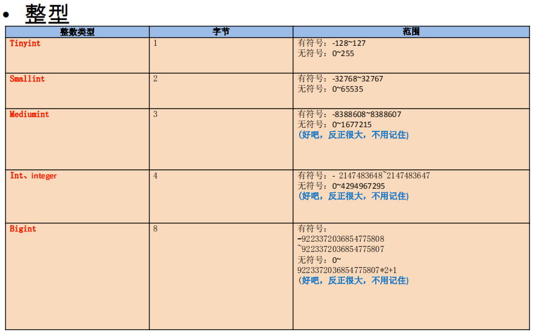
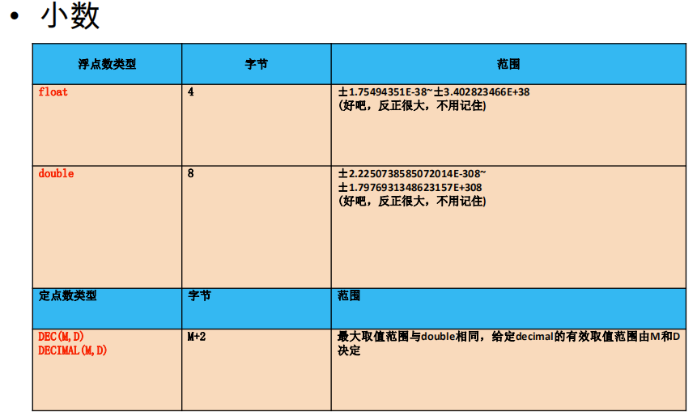
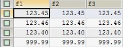
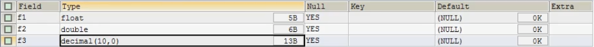
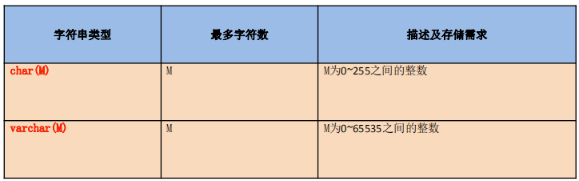
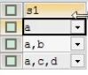
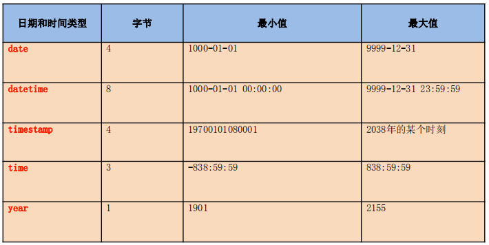
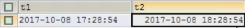

[TOC]
### 文章目录
####  常见的数据类型
###### 数值型:
整型、小数、定点数、浮点数
###### 字符型:
较短的文本：char、varchar

较长的文本：text、blob（较长的二进制数据）
###### 日期型：

#### 一、整型 tinyint、smallint、mediumint、int/integer、bigint

##### 1.1 分类：
tinyint、smallint、mediumint、int/integer、bigint<br/>
1   2  3 4 8
##### 1.2 特点：
① 如果不设置无符号还是有符号，默认是有符号，如果想设置无符号，需要添加unsigned关键字

② 如果插入的数值超出了整型的范围,会报out of range异常，并且插入临界值

③ 如果不设置长度，会有默认的长度

长度代表了显示的最大宽度，如果不够会用0在左边填充，但必须搭配zerofill使用！
##### 1.3 实操：
###### 1.如何设置无符号和有符号
zerofill：补零（也就默认无符号）
unsigned：无符号
```
DROP TABLE IF EXISTS tab_int;
CREATE TABLE tab_int(
    t1 INT(7) ZEROFILL,
    t2 INT(7) ZEROFILL 
);
DESC tab_int;
INSERT INTO tab_int VALUES(-123456);
INSERT INTO tab_int VALUES(-123456,-123456);    /*若为无符号，则默认临界值*/
INSERT INTO tab_int VALUES(2147483648,4294967296); /*报out of range异常，并且插入临界值*/
INSERT INTO tab_int VALUES(123,123);
SELECT * FROM tab_int;
```
#### 二、小数 decimal、float、double

##### 2.1 分类：
###### 1、浮点型
float(M,D)
double(M,D)
###### 2、定点型
desc(M,D)
decimal(M,D)
##### 2.2 特点：
① M：整数部位+小数部位

D：小数部位

如果超过范围，则插入临界值


② M和D都可以省略

如果是decimal，则M默认为10，D默认为0

如果是float和double，则会根据插入的数值的精度来决定精度

③ 定点型的精确度较高，如果要求插入数值的精度较高如货币运算等则考虑使用
###### 测试M和D
```
#测试M和D
DROP TABLE tab_float;
CREATE TABLE tab_float(
    f1 FLOAT,
    f2 DOUBLE,
    f3 DECIMAL
);
SELECT * FROM tab_float;
DESC tab_float;
INSERT INTO tab_float VALUES(123.4523,123.4523,123.4523);
INSERT INTO tab_float VALUES(123.456,123.456,123.456);
INSERT INTO tab_float VALUES(123.4,123.4,123.4);
INSERT INTO tab_float VALUES(1523.4,1523.4,1523.4);
```
##### 2.3 实操：
所选择的类型越简单越好，能保存数值的类型越小越好

#### 三、字符型 char、varchar、binary、varbinary、enum、set、text、blob
##### 3.1 类型：
###### 较短的文本:
char
varchar


###### 字符数：一个子母或一个文字都是字符
|   写法   |      | M的意思     | 特点	     |  空间的耗费     | 效率     |
| ---- | ---- | ---- | ---- | ---- | ---- | 
|   char  | char(M)   |    最大的字符数，可以省略，默认为1 |  固定长度的字符 | 比较耗费|高
|varchar|    varchar(M)	 |   最大的字符数，不可以省略 |  可变长度的字符		 | 比较节省|低

其他:<br/>
binary和varbinary用于保存较短的二进制<br/>
说明:类似于char和varchar，不同的是它们包含二进制字符串而不包含非二 进制字符串<br/>
enum用于保存枚举<br/>
set用于保存集合 <br/>
###### 较长的文本：<br/>

text<br/>

blob(较大的二进制)<br/>
###### 演示ENUM
```
CREATE TABLE tab_char(
    c1 ENUM('a','b','c')
);
INSERT INTO tab_char VALUES('a');
INSERT INTO tab_char VALUES('b');
INSERT INTO tab_char VALUES('c');
INSERT INTO tab_char VALUES('m');
INSERT INTO tab_char VALUES('A');
SELECT * FROM tab_set;
```
###### 2.演示：SET
```
CREATE TABLE tab_set(
    s1 SET('a','b','c','d')
);
INSERT INTO tab_set VALUES('a');
INSERT INTO tab_set VALUES('A,B');
INSERT INTO tab_set VALUES('a,c,d');

```

#### 四、日期型 year、date、time、datetime、timestamp

##### 4.1 分类：
date只保存日期

time 只保存时间

year只保存年

datetime保存日期+时间

timestamp保存日期+时间
##### 4.2 特点：

|      |   字节   | 范围     | 时区等的影响     |  
| ---- | ---- | ---- | ---- | 
|   datetime  | 8   |     1000——9999 |     不受
|    timestamp |    4 |    1970-2038  |  受    

1、Timestamp支持的时间范围较小

取值范围： 19700101080001——2038年的某个时间

Datetime的取值范围：1000-1-1 ——9999—12-31

2、timestamp和实际时区有关，更能反映实际的日 期，而datetime则只能反映出插入时的当地时区

3、timestamp的属性受Mysql版本和SQLMode的影响 很大

```
CREATE TABLE tab_date(
t1 DATETIME,
t2 TIMESTAMP
);
INSERT INTO tab_date VALUES(NOW(),NOW());
SELECT * FROM tab_date;
SHOW VARIABLES LIKE 'time_zone';
SET time_zone='+9:00';        /*更改一下时区*/ 
```
