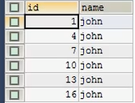

[toc]
## 常见约束
### 01 基本概念
#### 1.1 含义：

一种限制,用于限制表中的数据,为了保证表中的数据的准确和可靠性

#### 1.2 分类：六大约束
**NOT NULL**: 非空,用于保证该字段的值不能为空
```
比如姓名、学号等
```
**DEFAULT**:默认,用于保证该字段有默认值
```
比如性别
```
**PRIMARY KEY**:主键,用于保证该字段的值具有唯一性,并且非空
```
比如学号,员工编号等
```
**UNIQUE**:唯一,用于保证该字段的值具有唯一性,可以为空
```
比如座位号
```
**CHECK:**检查约束[mysql中不支持]
```
1、比如年龄、性别
```
**FOREIGN KEY**:外键，用于限制两个表的关系，用于保证该字段的值必须来自于主表的关联列的值
在从表添加外键约束，用于引用主表中某列的值
```
比如学生表的专业编号，员工表的部门编号，员工表的工种编号
```
#### 1.3 添加约束的时机：
1、创建表时
2、修改表时
#### 1.4 约束的添加分类：
**列级约束**: 六大约束语法上都支持,但外键约束没有效果
**表级约束**: 除了非空、默认,其他都支持
```
CREATE TABLE 表名(
    字段名 字段类型 列级约束,
    字段名 字段类型,
    表级约束
) 
```
#### 1.5 主键和唯一的大对比：

|      |   保证唯一性   | 是否为空     | 一个表中可以有多少个     |   是否允许组合   |
| ---- | ---- | ---- | ---- | ---- |
|    主键  | √   |     × |     至多有1个 |    √，但不推荐  |
|     唯一 |    √ |    √  |  可以有多个     |  √，但不推荐   |


#### 1.6 外键：
1、 要求在从表设置外键关系<br/>
2、 从表的外键列的类型和主表的关联列的类型要求一致或兼容,名字无要求<br/>
3、主表的关联列必须是一个key(一般是主键或唯一)<br/>
4、插入数据时,先插入主表,再插入从表;删除数据时,先删除从表,再删除主表
```
# 可以通过以下两种方式来删除主表的记录
# 方式一：级联删除
ALTER TABLE stuinfo ADD CONSTRAINT fk_stu_major FOREIGN KEY(majorid) REFERENCES major(id) ON DELETE CASCADE;
# 方式二：级联置空
ALTER TABLE stuinfo ADD CONSTRAINT fk_stu_major FOREIGN KEY(majorid) REFERENCES major(id) ON DELETE SET NULL;
```
###  02 具体讲解
CREATE DATABASE students;
#### 2.1 创建表时添加约束
##### 1.添加列级约束
语法:
直接在名字名和类型后面追加约束类型即可
只支持: 默认、非空、主键、唯一
```
USE students;
DROP TABLE stuinfo;
CREATE TABLE stuinfo(
    id INT PRIMARY KEY COMMENT '主键',
    stuName VARCHAR(20) NOT NULL UNIQUE COMMENT '非空',
    gender CHAR(1) CHECK(gender= '男' OR gender = '女') COMMENT '男或者女(检查)',
    seat INT UNIQUE COMMENT '唯一',
    age INT DEFAULT 18 COMMENT '默认约束',
    majorId INT REFERENCES major(id)
);
CREATE TABLE major(
    id INT PRIMARY KEY,
    majorName VARCHAR(20)
);
```

查看stuinfo中的所有索引,包括主键、外键、唯一
```
SHOW INDEX FROM stuinfo;
```


##### 2.添加表级约束
语法: 在各个字段的最下面
[constraint 约束名] 约束类型(字段名)
```
DROP TABLE IF EXISTS stuinfo;
CREATE TABLE `stuinfo` (
  `id` int NOT NULL COMMENT '主键',
  `stuName` varchar(20) NOT NULL COMMENT '非空',
  `gender` char(1) DEFAULT NULL COMMENT '男或者女(检查)',
  `seat` int DEFAULT NULL COMMENT '唯一',
  `age` int DEFAULT '18' COMMENT '默认约束',
  `majorId` int DEFAULT NULL,
  CONSTRAINT pk PRIMARY KEY (`id`),
  CONSTRAINT uq UNIQUE KEY `seat` (`seat`),
  CONSTRAINT ck CHECK (((`gender` = _utf8mb4'男') or (`gender` = _utf8mb4'女'))),
  CONSTRAINT fk_stuinfo_major FOREIGN KEY(majorid) REFERENCES major(id)#外键 
) ENGINE=InnoDB DEFAULT CHARSET=utf8mb4 COLLATE=utf8mb4_0900_ai_ci;

SHOW INDEX FROM stuinfo;
```
通用的写法: ★
```
CREATE TABLE IF NOT EXISTS stuinfo(
    id INT PRIMARY KEY,
    stuname VARCHAR(20),
    sex CHAR(1),
    age INT DEFAULT 18,
    seat INT UNIQUE,
    majorid INT,
    CONSTRAINT fk_stuinfo_major FOREIGN KEY(majorid) REFERENCES major(id)
);
```
#### 2.2 修改表时添加约束
##### 1.添加列级约束
```
ALTER FROM 表名 MODIFY COLUMN 字段名 字段类型 新约束;
```
##### 2.添加表级约束
```
ALTER FROM 表名 ADD [CONSTRAINT 约束名] 约束类型[字段名] 【外键的引用】;
```
###### 案例:
```
DROP TABLE IF EXISTS stuinfo;
CREATE TABLE stuinfo(
    id INT,
    stuname VARCHAR(20),
    gender CHAR(1),
    seat INT,
    age INT,
    majorid INT
)
DESC stuinfo;
```


##### 3.案例实操
```
#1.添加非空约束
ALTER TABLE stuinfo MODIFY COLUMN email VARCHAR(25) NOT NULL;
#2.添加默认约束
ALTER TABLE stuinfo MODIFY COLUMN age INT DEFAULT 18;
#3.添加主键
#①列级约束
ALTER TABLE stuinfo MODIFY COLUMN id INT PRIMARY KEY;
#②表级约束
ALTER TABLE stuinfo ADD PRIMATY KEY(id);
#4.添加唯一
#①列级约束
ALTER TABLE stuinfo MODIFY COLUMN seat INT UNIQUE;
#②表级约束
ALTER TABLE stuinfo ADD UNIQUE(seat);
#5.添加外键
ALTER TABLE stuinfo ADD CONSTRAINT fk_stuinfo_major FOREIGN KEY(majorid) REFERENCES major(id); 
```
####  2.3 修改表时删除约束
```
#1.删除非空约束
ALTER TABLE stuinfo MODIFY COLUMN stuname VARCHAR(20) NULL;
#2.删除默认约束
ALTER TABLE stuinfo MODIFY COLUMN age INT ;
#3.删除主键
ALTER TABLE stuinfo DROP PRIMARY KEY;
#4.删除唯一
ALTER TABLE stuinfo DROP INDEX seat;
#5.删除外键
ALTER TABLE stuinfo DROP FOREIGN KEY fk_stuinfo_major;
SHOW INDEX FROM stuinfo;
```

### 03 案例实操
#### 1.向表emp5的id列中添加PRIMARY KEY约束（my_emp_id_pk）
```
ALTER TABLE emp5 MODIFY COLUMN id INT PRIMARY KEY NOT NULL;
ALTER TABLE emp2 ADD CONSTRAINT my_emp_id_pk PRIMARY KEY(id);
```
#### 2. 向表dept2的id列中添加PRIMARY KEY约束（my_dept_id_pk）
```
ALTER TABLE dept2 ADD CONSTRAINT my_dept_id_pk PRIMARY KEY(department_id);
```
#### 3. 向表emp5中添加列dept_id，并在其中定义FOREIGN KEY约束，与之相关联的列是dept2表中的id列。
```
ALTER table emp5 ADD COLUMN dept_id INT;
ALTER table emp5 ADD CONSTRAINT fk_emp5_dept2 FOREIGN KEY(dept_id) REFERENCES dept2(department_id);
```
|      |   位置   | 支持的约束类型     | 是否可以起约束名     |  
| ---- | ---- | ---- | ---- | 
|    列级约束：  | 列的后面   |     语法都支持，但外键没有效果 |     不可以
|     列级约束： |    所有列的下面 |    默认和非空不支持，其他支持  |  可以（主键没有效果）    

##  标识列
### 01 基本概念
又称为自增长列<br/>
含义：可以不用手动的插入值,系统提供默认的序列值
### 02 特点：
1、标识列必须和主键搭配吗？不一定，但要求是一个key（主键、外键、唯一、自定义）

2、一个表可以有几个标识列？至多一个！

3、标识列的类型只能是数值型

4、标识列可以通过 SET auto_increment_increment=3;设置步长

可以通过 手动插入值，设置起始值
### 03 案例演示
#### 3.1 创建表时设置标识列
```
DROP TABLE IF EXISTS tab_identity;
CREATE TABLE tab_identity(
    id INT  ,
    NAME FLOAT UNIQUE AUTO_INCREMENT,
    seat INT 
);
```
#### 3.2 查询自增长的值
```
SHOW VARIABLES LIKE '%auto_increment%';
```

#### 3.3 修改步长
```
SET auto_increment_increment=3;
```

#### 3.4 需要修改起始值
就直接插入指定起始值,后面再插入NULL
#### 3.5 小结
自增长列 特点：<br/>
1、不再手动插入值,可以自动提供序列值,默认从1开始,默认从1开始,步长为1<br/>
auto_increment_increment<br/>
如果要更改起始值: 手动插入值<br/>
如果要更改步长：更改系统变量<br/>
set auto_increment_increment=值;<br/>
2、一个表之多有一个自增长列<br/>
3、自增长列只能支持数值型<br/>
4、自增长列必须为一个key<br/>

#####  一、创建表时设置自增长列
create table 表(
   &nbsp;&nbsp;&nbsp;&nbsp;字段名 字段类型 约束 auto_increment
)
##### 二、修改表时设置自增长列
alter table 表 modify column 字段名 字段类型 约束 auto_increment
##### 删除自增长列
alter table 表 modify column 字段名 字段类型 约束