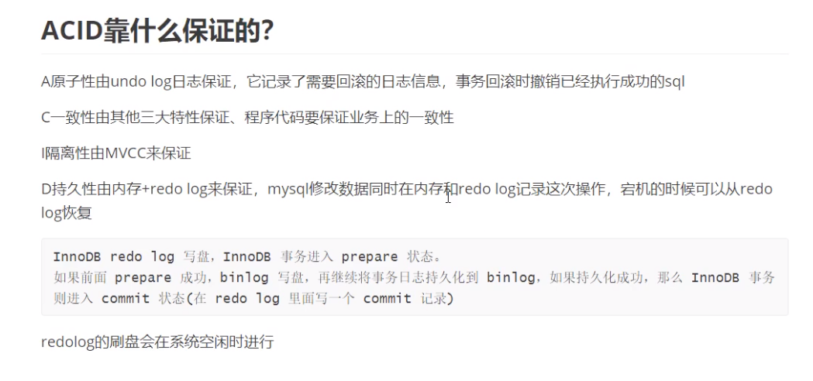
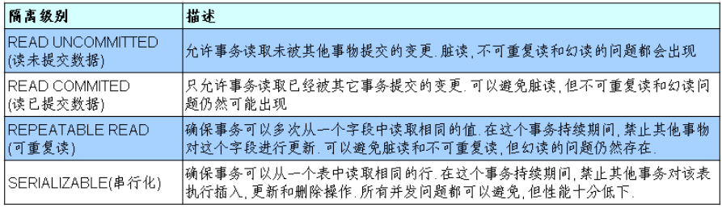

[TOC]
## 文章目录
### 一、事物的基本概念
#### 1.1 基本定义
Transaction Control Language 事务控制语言

简单定义: 一个或一组sql语句组成一个执行单元,这个执行单元要么全部执行,要么全部不执行

完整定义:
简单定义：一个或一组sql语句组成一个执行单元，这个执行单元要么全部执行，要么全部不执行

完整定义：事务由单独单元的一个或多个SQL语句组成，在这 个单元中，每个MySQL语句是相互依赖的。而整个单独单 元作为一个不可分割的整体，如果单元中某条SQL语句一 旦执行失败或产生错误，整个单元将会回滚。所有受到影响的数据将返回到事物开始以前的状态；如果单元中的所 有SQL语句均执行成功，则事物被顺利执行。
```
案例：转账

张三丰  1000
郭襄	1000

update 表 set 张三丰的余额=500 where name='张三丰'
意外
update 表 set 郭襄的余额=1500 where name='郭襄'

```
#### 1.2 MySQL 中的存储引擎[了解]
存储引擎：<br/>
1、概念： 在mysql中的数据用各种不同的技术存储在文件(或内存)中<br/>
2、通过show engines; 来查看mysql支持的存储引擎<br/>
3、在mysql中用的最多的存储引擎有: innodb，myisam,memory等。
其中innodb支持事物,而myisam,memory等不支持事务<br/>
#### 1.3 事务的ACID(acid)属性
原子性：一个事务不可再分割，要么都执行要么都不执行.<br/>
一致性：一个事务执行会使数据从一个一致状态切换到另外一个一致状态.<br/>
隔离性：一个事务的执行不受其他事务的干扰.<br/>
持久性：一个事务一旦提交，则会永久的改变数据库的数据.<br/>

### 二、事务的创建
### 事务的隔离级别（4种）
#### 2.1 隐式事务：事务没有明显的开启和结束的标记
比如insert、update、delete语句
delete from 表 where id = 1;
#### 2.2 显式事务：事务具有明显的开启和结束的标记
前提: 必须先设置自动提交功能为禁用
set autocommit = 0;
##### 步骤1：开启事务
start transaction;可选的
##### 步骤2：编写事务中的sql语句(select insert update delete)
语句1;

语句2;

…

##### 步骤3：结束事务
commit; 提交事务 <br/>
rollback; 回滚事务 <br/>
savepoint 节点名;设置保存点 <br/>
#### 2.3 演示
```
#1.演示事务的使用步骤

#开启事务
SET autocommit=0;
START TRANSACTION;
#编写一组事务的语句
UPDATE account SET balance = 1000 WHERE username='张无忌';
UPDATE account SET balance = 1000 WHERE username='赵敏';

#结束事务
ROLLBACK;
#commit;

SELECT * FROM account;

```
#### 2.4 演示事务对于delete和truncate的处理的区别
```
SET autocommit=0;
START TRANSACTION;

DELETE FROM account;
ROLLBACK;
```
#### 2.5 演示savepoint 的使用
```
SET autocommit=0;
START TRANSACTION;
DELETE FROM account WHERE id=25;
SAVEPOINT a;#设置保存点
DELETE FROM account WHERE id=28;
ROLLBACK TO a;#回滚到保存点


SELECT * FROM account;

```
### 三、事务的隔离级别（4种）
#### 3.1 基本概念
数据库事务的隔离性: 数据库系统必须具有隔离并发运行各个事务的能力, 使它们不会相互影响, 避免各种并发问题.

一个事务与其他事务隔离的程度称为隔离级别. 数据库规定了多种事务隔 离级别, 不同隔离级别对应不同的干扰程度, 隔离级别越高, 数据一致性就 越好, 但并发性越弱.



|      |   脏读   | 不可重复读     | 幻读     |  
| ---- | ---- | ---- | ---- | 
|  read uncommitted：  | √   |   √     |     √
|  read committed： |    x |    √   |  √
|  repeatable read  | x   |     x |     √
|  serializable |    x |    x |   x


⭕️ Oracle 支持的 2 种事务隔离级别：READ COMMITED, SERIALIZABLE。

⭕️  Oracle 默认第二个隔离级别 read committed

⭕️ Mysql 支持 4 种事务隔离级别. Mysql 默认的事务隔离级别为: REPEATABLE READ

⭕️ mysql中默认 第三个隔离级别 repeatable read
#### 3.2 在 MySql 中设置隔离级别
⭕ ️每启动一个 mysql 程序, 就会获得一个单独的数据库连接. 每 个数据库连接都有一个全局变量 @@tx_isolation, 表示当前的事务隔离级别.
##### 查看隔离级别
```
select @@tx_isolation;
```
##### 设置隔离级别
```
set session|global transaction isolation level 隔离级别;
```
设置当前mySQL连接的隔离级别：
```
set transaction isolation level read committed; 
```
设置数据库系统的全局的隔离级别:
```
set global transaction isolation level read committed;
```

其他的数据库跳转:[mysql,oracle,sql server中的默认事务隔离级别查看,更改](https://link.csdn.net/?target=https%3A%2F%2Fwww.cnblogs.com%2Fwho-else%2Fp%2F6659564.html)


#### 4 并发事务
⭕ 事务的并发是如何发生的？<br/>
多个事务 同时操作 同一数据库的相同的数据时

<span style="color:red;">并发问题都有哪些？</span><br/>
⭕ 脏读：一个事务读取了其他事务还没有提交的数据，读到的是其他事务“更新”的数据<br/>
⭕ 不可重复读：一个事务多次读取，结果不一样<br/>
⭕ 幻读：一个事务读取了其他事务还没有提交的数据，只是读到的是其他事务“插入”的数据<br/>
⭕ 更新丢失：当两个或者多个事务选择同一行，然后基于最初的选定的值更新该行时，由于每一个事务都不知道其他事务的存在，就会发生更新问题。最后的更新覆盖了其他事务所做的更新。<br/>

如何解决并发问题
通过设置隔离级别来解决并发问题


<span style="color:red;">事务的隔离级别</span><br/>

|      |   读数据一致性   | 脏读     | 不可重复读     |  幻读 |
| ---- | ---- | ---- | ---- | ---- |
| read uncommitted: 读未提交  | 最低级别，只能保证不读取物理上损坏的数据   |   x     |     x|x
| read committed: 读已提交 |    语句级 |    √   |  x |x
|repeatable read: 可重复读 | 事务级   |     √ |     √  |x
| serializable: 串行化 (每次读都需获得表级共享锁，读写相互都会阻塞,性能低下)serializable: 串行化 (每次读都需获得表级共享锁，读写相互都会阻塞,性能低下) |   最高级别，事务级 |  √ |   √  |√
