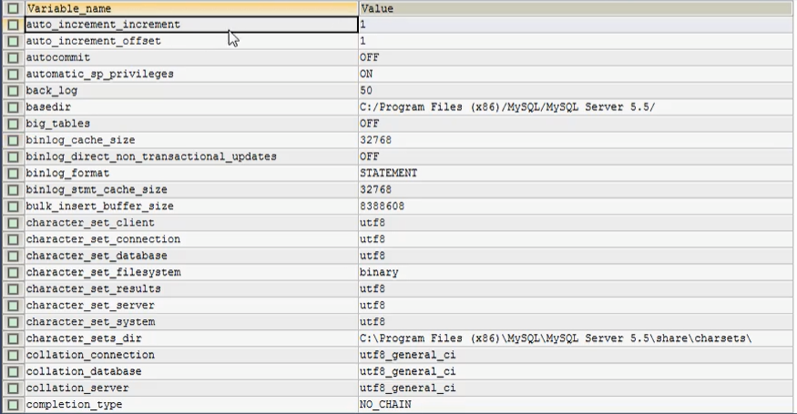

[TOC]
### 一、系统变量
说明: 变量由系统定义,不是用户定义,属于服务器层面
注意: 全局变量需要添加global关键字,会话变量需要添加session关键字，如果不写，默认会话级别

使用步骤：
##### 1、查看所有系统变量
```
show global|【session】variables;
```
##### 2、查看满足条件的部分系统变量
```
show global|【session】 variables like '%char%';
```
##### 3、查看指定的系统变量的值
```
select @@global|【session】系统变量名;
```
##### 4、为某个系统变量赋值
方式一:
```
set global|【session】系统变量名=值;
```
方式二:
```
set @@global|【session】系统变量名=值;
```
#### 1.1 全局变量
作用域：针对于所有会话（连接）有效，但不能跨重启
##### ①查看所有全局变量
```
SHOW GLOBAL VARIABLES;
```
##### ②查看满足条件的部分系统变量
```
SHOW GLOBAL VARIABLES LIKE '%char%';
```
##### ③查看指定的系统变量的值
```
SELECT @@global.autocommit;
```
##### ④为某个系统变量赋值
```
SET @@global.autocommit=0;
SET GLOBAL autocommit=0;
```
#### 1.2会话变量
作用域：针对于当前会话（连接）有效（与全局变量的差别）

##### ①查看所有会话变量

SHOW SESSION VARIABLES;



##### ②查看满足条件的部分会话变量

```
SHOW SESSION VARIABLES LIKE '%char%';
```

##### ③查看指定的会话变量的值
```
SELECT @@autocommit;
SELECT @@session.tx_isolation;
```

##### ④为某个会话变量赋值
```
SET @@session.tx_isolation='read-uncommitted';
SET SESSION tx_isolation='read-committed';
```

### 二、自定义变量
说明：变量由用户自定义，而不是系统提供的

使用步骤：（类似java的使用）

1、声明

2、赋值

3、使用（查看、比较、运算等）


#### 2.1 用户变量
作用域：针对于当前会话（连接）有效，作用域同于会话变量

赋值操作符：=或:=
#####  ①声明并初始化
```
SET @变量名=值;
SET @变量名:=值;
SELECT @变量名:=值;
```
##### ②赋值（更新变量的值）
方式一：
```
SET @变量名=值;
SET @变量名:=值;
SELECT @变量名:=值;
```

方式二：
<span style="color:red;">SELECT 字段 INTO @变量名 FROM 表;</span>
#####  ③使用（查看变量的值）
```
SELECT @变量名;
```
#### 2.2 局部变量
作用域：仅仅在定义它的begin end块中有效

应用在 begin end中的第一句话
##### ①声明
```
DECLARE 变量名 类型;
DECLARE 变量名 类型 【DEFAULT 值】;
```
##### ②赋值（更新变量的值）
方式一：

<span style="color:red;">SET 局部变量名=值;</span>

<span style="color:red;">SET 局部变量名:=值;</span>

<span style="color:red;">SELECT 局部变量名:=值;</span>

方式二：
<span style="color:red;">SELECT 字段 INTO 具备变量名 FROM 表;</span>

##### ③使用（查看变量的值）
```
SELECT 局部变量名;
```
#### 2.3 案例：声明两个变量，求和并打印
```
#用户变量
SET @m=1;

SET @n=1;

SET @sum=@m+@n;

SELECT @sum;

#局部变量

DECLARE m INT DEFAULT 1;

DECLARE n INT DEFAULT 1;

DECLARE SUM INT;

SET SUM=m+n;

SELECT SUM;

```
##### 用户变量和局部变量的对比
|     作用域 |   定义位置   | 语法     | 
| ---- | ---- | ---- | 
|  用户变量 当前会话  | 会话的任何地方 |  加@符号，不用指定类型    
| 局部变量 |    定义它的BEGIN END中 |   BEGIN END的第一句话 一般不用加@,需要指定类型
