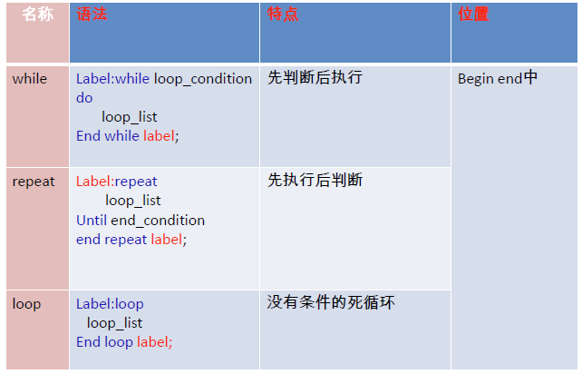

[TOC]
### 文章目录
流程控制结构

顺序、分支、循环
#### 一、分支结构
##### 1.1 if函数
语法： if(条件,值1,值2)
功能: 实现双分支
应用在begin end中或外面
##### 1.2 case结构
语法：

情况1: 类似于switch
```
case 变量或表达式
when 值1 then 语句1;
when 值2 then 语句2;
...
else 语句n;
end
```
作为表达式：应用在begin end 中或外面

作为独立的语句：只能在begin end 中
##### 1.3 if结构
语法:
```
if 条件1 then 语句1;
elseif 条件2 then 语句2;
...
else 语句n
end if;
```
功能：类似于多重if

只能应用在begin end 中
###### 案例1：创建函数，实现传入成绩，如果成绩>90,返回A，如果成绩>80,返回B，如果成绩>60,返回C，否则返回D
```
CREATE FUNCTION test_if(score FLOAT) RETURNS CHAR
BEGIN
	DECLARE ch CHAR DEFAULT 'A';
	IF score>90 THEN SET ch='A';
	ELSEIF score>80 THEN SET ch='B';
	ELSEIF score>60 THEN SET ch='C';
	ELSE SET ch='D';
	END IF;
	RETURN ch;
	
	
END $

SELECT test_if(87)$
```
###### 案例2：创建存储过程，如果工资<2000,则删除，如果5000>工资>2000,则涨工资1000，否则涨工资500
```
CREATE PROCEDURE test_if_pro(IN sal DOUBLE)
BEGIN
	IF sal<2000 THEN DELETE FROM employees WHERE employees.salary=sal;
	ELSEIF sal>=2000 AND sal<5000 THEN UPDATE employees SET salary=salary+1000 WHERE employees.`salary`=sal;
	ELSE UPDATE employees SET salary=salary+500 WHERE employees.`salary`=sal;
	END IF;
	
END $

CALL test_if_pro(2100)$
```
###### 案例1：创建函数，实现传入成绩，如果成绩>90,返回A，如果成绩>80,返回B，如果成绩>60,返回C，否则返回D
```
CREATE FUNCTION test_case(score FLOAT) RETURNS CHAR
BEGIN
DECLARE ch CHAR DEFAULT 'A';

	CASE 
	WHEN score>90 THEN SET ch='A';
	WHEN score>80 THEN SET ch='B';
	WHEN score>60 THEN SET ch='C';
	ELSE SET ch='D';
	END CASE;
	
	RETURN ch;
END $

SELECT test_case(56)$
```
#### 二、循环结构
###### 分类
while、loop、repeat

###### 循环控制:
循环控制：
iterate类似于 continue，继续，结束本次循环，继续下一次

leave 类似于 break，跳出，结束当前所在的循环
##### 2.1 while
```
【标签:】while 循环条件 do
	循环体;
end while【 标签】;
```
联想：
```
while(循环条件){

	循环体;
}
```

##### 2.2 loop
语句:
```
【标签:】loop
	循环体;
end loop 【标签】;
```
可以用来模拟简单的死循环
##### 2.3 repeat
语法：
```
【标签：】repeat
循环体;
until 结束循环的条件
end repeat 【标签】;
```

###### 1.没有添加循环控制语句
案例：批量插入，根据次数插入到admin表中多条记录
```
DROP PROCEDURE pro_while1$
CREATE PROCEDURE pro_while1(IN insertCount INT)
BEGIN
	DECLARE i INT DEFAULT 1;
	WHILE i<=insertCount DO
		INSERT INTO admin(username,`password`) VALUES(CONCAT('Rose',i),'666');
		SET i=i+1;
	END WHILE;
	
END $

CALL pro_while1(100)$
```
java的循环
CALL pro_while1(100)$
```
int i=1;
while(i<=insertcount){
//插入
i++;
}
CALL pro_while1(100)$
```
###### 2.添加leave语句
案例：批量插入，根据次数插入到admin表中多条记录，如果次数>20则停止
```
TRUNCATE TABLE admin$
DROP PROCEDURE test_while1$
CREATE PROCEDURE test_while1(IN insertCount INT)
BEGIN
DECLARE i INT DEFAULT 1;
a:WHILE i<=insertCount DO
INSERT INTO admin(username,`password`) VALUES(CONCAT('xiaohua',i),'0000');
IF i>=20 THEN LEAVE a;
END IF;
SET i=i+1;
END WHILE a;
END $

CALL test_while1(100)$
```

###### 3.添加iterate语句
```
TRUNCATE TABLE admin$
DROP PROCEDURE test_while1$
CREATE PROCEDURE test_while1(IN insertCount INT)
BEGIN
	DECLARE i INT DEFAULT 0;
	a:WHILE i<=insertCount DO
		SET i=i+1;
		IF MOD(i,2)!=0 THEN ITERATE a;
		END IF;
		
		INSERT INTO admin(username,`password`) VALUES(CONCAT('xiaohua',i),'0000');
		
	END WHILE a;
END $

CALL test_while1(100)$
int i=0;
while(i<=insertCount){
	i++;
	if(i%2==0){
		continue;
	}
	插入
	
}
```
#### 三、案例
已知表stringcontent其中字段：

id 自增长

content varchar(20)

向该表插入指定个数的，随机的字符串
```
DROP TABLE IF EXISTS stringcontent;
CREATE TABLE stringcontent(
	id INT PRIMARY KEY AUTO_INCREMENT,
	content VARCHAR(20)
	
);
DELIMITER $
CREATE PROCEDURE test_randstr_insert(IN insertCount INT)
BEGIN
	DECLARE i INT DEFAULT 1;
	DECLARE str VARCHAR(26) DEFAULT 'abcdefghijklmnopqrstuvwxyz';
	DECLARE startIndex INT;#代表初始索引
	DECLARE len INT;#代表截取的字符长度
	WHILE i<=insertcount DO
		SET startIndex=FLOOR(RAND()*26+1);#代表初始索引，随机范围1-26
		SET len=FLOOR(RAND()*(20-startIndex+1)+1);#代表截取长度，随机范围1-（20-startIndex+1）
		INSERT INTO stringcontent(content) VALUES(SUBSTR(str,startIndex,len));
		SET i=i+1;
	END WHILE;

END $

CALL test_randstr_insert(10)$

```
🈚 RAND() 随机数生成函数，随机生成（0，1）

🈚 RFLOOR

🈚 RSUBSTR(str,startIndex,len) 截取字符串函数