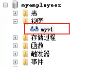
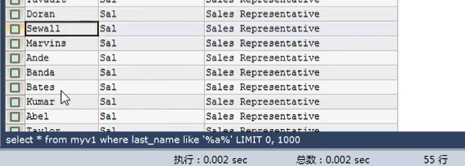
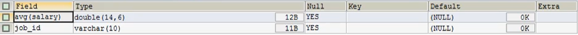
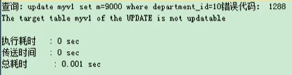
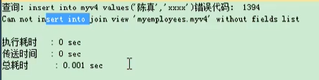
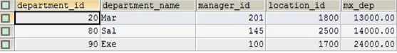

[TOC]
## 一、基本概念

### 1.1 基本定义
视图: MYSQL从5.0.1版本开始提供视图功能。一种虚拟存在的表,行和列的数据来定义视图的
查询中使用的表,并且是在使用视图时动态生成的,只保存了sql逻辑,不保存查询的结果

比如: 舞蹈班和普通班级的对比

创建语法的关键字 是否实际占用物理空间 使用

### 1.2 应用场景
⭕️ 多个地方用到同样的查询结果

⭕️ 该查询结果使用的sql语句较复杂

### 1.3 示列

#### 案例:查询姓张的学生名和专业名
```
SELECT stuname '学生名',majorName '专业名' FROM stuinfo s INNER JOIN major m ON s.majorId = m.id WHERE s.stuname  LIKE '张%';

CREATE VIEW v1 AS
SELECT stuname '学生名',majorName '专业名' FROM stuinfo s INNER JOIN major m ON s.majorId = m.id;

SELECT * FROM v1 WHERE stuname  LIKE '张%';
```

### 1.4 作用
⭕️ 重用SQL语句
⭕️ 简化复杂的sql操作，不必知道它的查询细节
⭕️ 保护数据,提高安全性

### 1.5 视图和表的对比
|  视图	    |   create view   | 只是保存了sql逻辑     | 增删改查，只是一般不能增删改
| ---- | ---- | ---- | ---- | 
|表 | create table  |  保存了数据     |    增删改查

## 具体操作
### 2.1 创建视图
语法：
create view 视图名
as
查询语句:
Use myemployees;

#### 1.查询姓名中包含a字符的员工名、部门名和工种信息

①创建
```
CREATE VIEW myv1 AS
SELECT last_name,department_name,job_title FROM employees e
INNER JOIN departments d ON e.department_id = d.department_id
INNER JOIN jobs j ON j.job_id = e.job_id;
```


②使用
```
SELECT * FROM myv1 WHERE last_name LIKE '%a%';
```


#### 2.查询各部门的平均工资级别
①创建视图查看每个部门的平均工资
```
CREATE VIEW avg_salaryv1
AS
SELECT AVG(salary) ag,department_id FROM employees 
GROUP BY department_id;
```
②使用
```
SELECT avg_salaryv1.ag,g.grade_level
FROM avg_salaryv1
JOIN job_grades g
ON avg_salaryv1.ag BETWEEN g.`lowest_sal` AND g.`highest_sal`;
```

3.查询平均工资最低的部门信息
```
SELECT * FROM avg_salaryv1 ORDER BY ag LIMIT 1;
```

4.查询平均工资最低的部门名和工资
```
CREATE VIEW avg_salaryv2
AS
SELECT * FROM avg_salaryv1 ORDER BY ag LIMIT 1;

SELECT d.*,as2.ag FROM avg_salaryv2 as2 JOIN departments d ON as2.department_id = d.department_id;
```


### 2.2视图的修改
#### 方式一：
create or replace view 视图名
as

查询语句:
```
CREATE OR REPLACE VIEW  avg_salaryv2 AS
SELECT AVG(salary) ag,job_id FROM employees GROUP BY job_id;
```

#### 方式二:
语法： alter view 视图名 as
查询语句:
```
ALTER VIEW avg_salaryv2 AS SELECT * FROM employees;
```

### 2.3删除视图
语法：drop view 视图名,视图名,…;
```
DROP VIEW myv1,avg_salaryv1;
```


⭕️ 首先用户需要有删除的权限，示例是用root基本都有权限首先用户需要有删除的权限，示例是用root基本都有权限

### 2.4查看视图
```
DESC avg_salaryv2;

SHOW CREATE VIEW avg_salaryv2;
--更具体的信息，包括创建后的大部分信息
```


### 2.5 视图的更新
先创建两个视图
```
CREATE OR REPLACE VIEW myv1
AS
SELECT last_name,email,salary*12*(1+IFNULL(commission_pct,0)) "annual salary"
FROM employees;

CREATE OR REPLACE VIEW myv1
AS
SELECT last_name,email
FROM employees;

```
SELECT * FROM myv1;

SELECT * FROM employees;
#### 2.5.1 插入
```
INSERT INTO myv1 VALUES('张飞','zf@qq.com');
```
⭕️ 会对原始表有修改！
⭕️ 所以往往会给视图设置权限

#### 2.5.2 修改
```
UPDATE myv1 SET last_name = '张无忌' WHERE last_name='张飞';
```

#### 2.5.3 删除
```
DELETE FROM myv1 WHERE last_name = '张无忌';
```
具备以下特点的视图不允许更新
##### ①包含以下关键字的sql语句：分组函数、distinct、group by、having、union或者union all

```
CREATE OR REPLACE VIEW myv1
AS
SELECT MAX(salary) m,department_id
FROM employees
GROUP BY department_id;

SELECT * FROM myv1;

#更新
UPDATE myv1 SET m=9000 WHERE department_id=10;
```



##### ②常量视图
```
CREATE OR REPLACE VIEW myv2
AS

SELECT 'john' NAME;

SELECT * FROM myv2;

#更新
UPDATE myv2 SET NAME='lucy';
```
##### ③Select中包含子查询
```
CREATE OR REPLACE VIEW myv3
AS
SELECT department_id,(SELECT MAX(salary) FROM employees) 最高工资
FROM departments;

#更新
SELECT * FROM myv3;
UPDATE myv3 SET 最高工资=100000;
```

##### ④join
```
CREATE OR REPLACE VIEW myv4
AS

SELECT last_name,department_name
FROM employees e
JOIN departments d
ON e.department_id  = d.department_id;

#更新

SELECT * FROM myv4;
UPDATE myv4 SET last_name  = '张飞' WHERE last_name='Whalen';
INSERT INTO myv4 VALUES('陈真','xxxx');

```


###### ⑤from一个不能更新的视图
```
CREATE OR REPLACE VIEW myv5
AS

SELECT * FROM myv3;

#更新

SELECT * FROM myv5;

UPDATE myv5 SET 最高工资=10000 WHERE department_id=60;

```


##### ⑥where子句的子查询引用了from子句中的表
```
CREATE OR REPLACE VIEW myv6
AS

SELECT last_name,email,salary
FROM employees
WHERE employee_id IN(
    SELECT  manager_id
    FROM employees
    WHERE manager_id IS NOT NULL
);

#更新
SELECT * FROM myv6;
UPDATE myv6 SET salary=10000 WHERE last_name = 'k_ing';

```

## 案例
一、创建视图emp_v1,要求查询电话号码以‘011’开头的员工姓名和工资、邮箱
```
CREATE OR REPLACE VIEW emp_v1
AS
SELECT last_name,salary,email
FROM employees
WHERE phone_number LIKE '011%';
```

二、创建视图emp_v2，要求查询部门的最高工资高于12000的部门信息
```
CREATE OR REPLACE VIEW emp_v2
AS
SELECT MAX(salary) mx_dep,department_id
FROM employees
GROUP BY department_id
HAVING MAX(salary)>12000;


SELECT d.*,m.mx_dep
FROM departments d
JOIN emp_v2 m
ON m.department_id = d.`department_id`;
```
